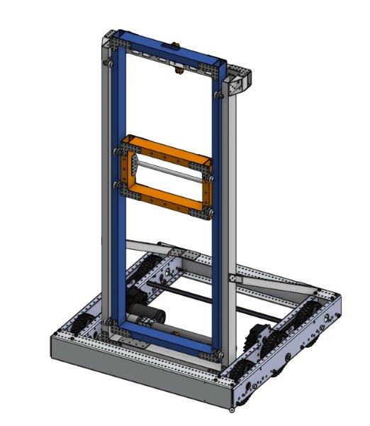
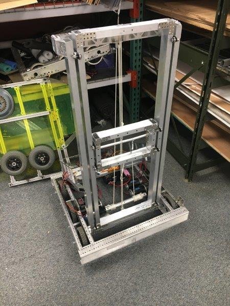

### Elevator Bot
Before the season began, I experimented with the CAD program OnShape. I decided to model and build an elevator as practice before the real season. One of our mentors had recently bought a CNC router and was happy to help me fabricate the parts for my design. In just over four weeks, I designed and built a functional elevator robot with the help of a few friends. The elevator worked phenomenally, and it was the first subsystem to ever be produced by 3648 using computer-aided design.

    
     
    

> ##### The CAD model for the elevator bot next to the fabricated version

This project proved the feasibility of using CAD in our shop and paved the way for using CAD for design and rapid prototyping for the rest of the season.