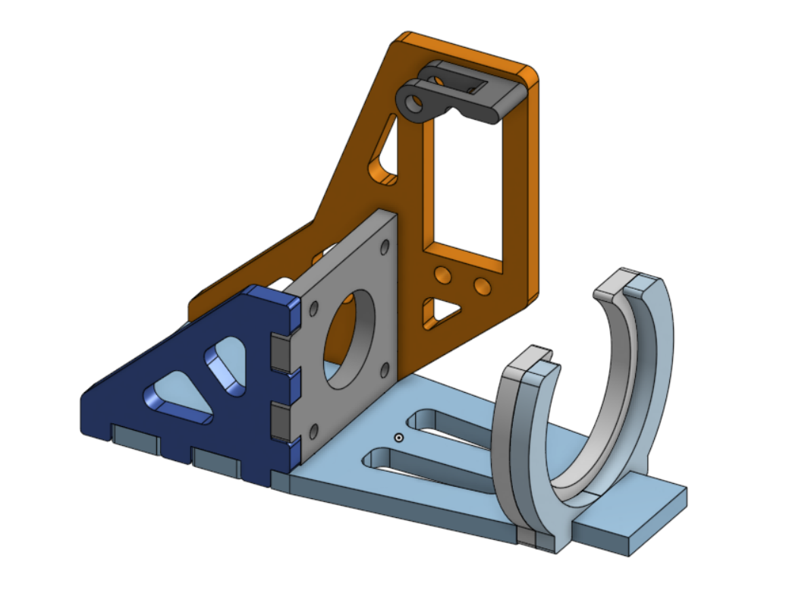
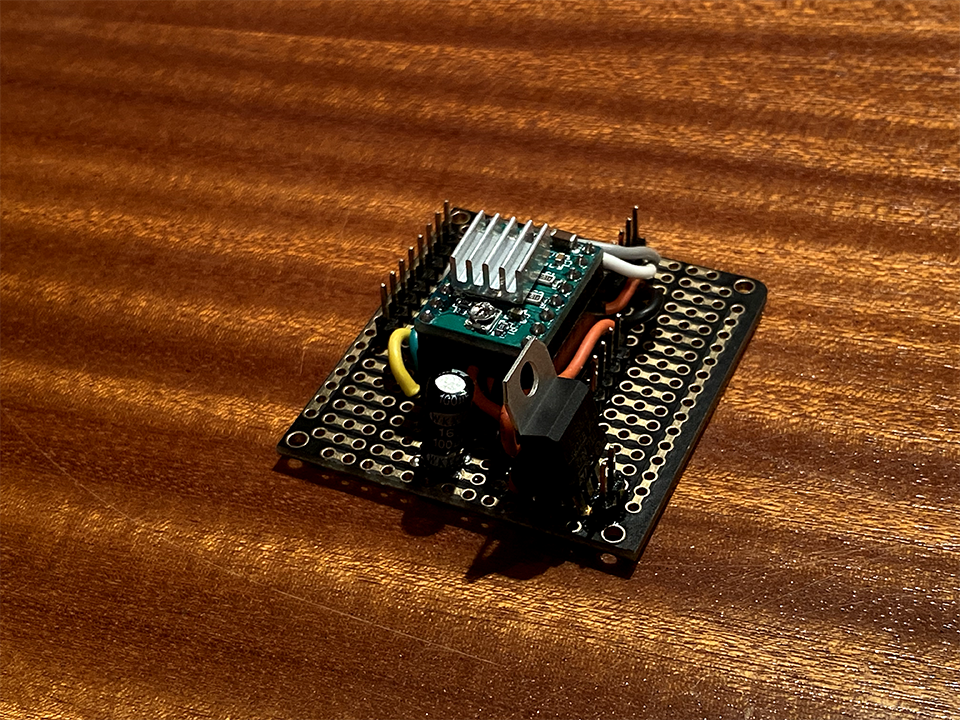
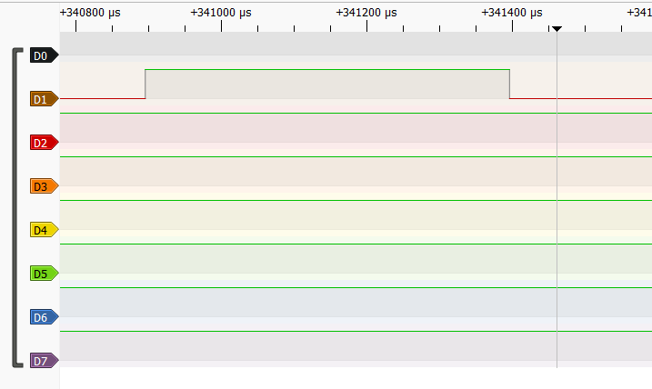

## Introduction

The CNC Combination Cracker (who I call Clicky) is a robot designed to efficiently find the combination to any master lock brand combination lock.
These are the classic locks you probably associate with your high school locker. 
First, place the lock in the lock holder and ensure the dial manipulator is seated on the dial.
Rotate the dial so that the lock is at 0, then press the button on the microcontroller.
Clicky will begin speedily trying combinations, and crack the combo!


## System Overview

### Hardware

Clicky's body is made from clear laser cut acrylic, housing the electronics that make him work. A NEMA 17 stepper motor rotates the dial and an analog feedback servo is used to pull on the shackle and determine if the lock has been opened. All of the electronics are driven through a custom circuit board powered by a wall outlet.

### Software

I wrote custom stepper and analog servo drivers to control Clicky, as well a library for using the buttons and capacitive touch slider on the FRDM-KL46Z to control a LCD based UI. I also implemented the cracking algorithm, which requires the user to find and enter three binding points on the lock. Using exploits in the master lock's design, the number of combinations is dropped down to 8, which can be attempted in under 30 seconds.

## Project Video Demo

<iframe width="100%" style="aspect-ratio: 9/5" src="https://www.youtube.com/embed/n434a4aqk5E" title="CNC Combo cracker: ECE 3140 Final project" frameborder="0" allow="accelerometer; autoplay; clipboard-write; encrypted-media; gyroscope; picture-in-picture; web-share" allowfullscreen></iframe>

> ##### click on the thumbnail to watch the video

## Technical Description

### Hardware

The main drivers of Clicky are the NEMA 17 stepper motor and the analog feedback servo motor. 

The quintessential requirement of combination cracking is turning the dial. For this job I chose a stepper motor. Stepper motors are easy to control, fast, and accurate. Steppers are controlled in discrete "steps", each constituting a consistent percentage of a rotation. For the stepper I chose, this was 200 steps per rotation. Given that a master lock has 40 positions, this gives a resolution of 5 steps per number on the lock.

To open the shackle, and I needed a high torque motor that I could control positionally. A standard hobby servo meets these requirements perfectly, but I also needed to determine if the shackle did in fact open. An analog feedback servo offers an feedback signal reporting the actual position of the arm, allowing me to check if the servo was able to pull the shackle out of the lock.

Once I decided on the components I wanted to use, I was time to build the body of the robot. I used a CAD program named OnShape to design the parts for Clicky. The parts were then either 3D printed in PLA or laser cut from 3/16" acrylic, and assembled using screws. The end result is a clean transparent look with red and pink highlights.



Next, I needed to power and control the motors. Clicky uses a custom circuit board to provide a central source of power and control.



Power is supplied from a 12V 2A wall adapter, which provides direct power to the stepper motor. I also used a 6V step down to provide power for the FRDM-KL46Z and the servo motor. Due to the nature of DC motors, voltage spikes are unavoidable during operation. To prevent these spikes from disrupting the power to the FRDM-KL46Z, I added a 100 microfarad capacitor across the supply lines. To control the stepper motor, I used Allegro’s A4988 stepper driver. The driver is capable of powering the 2A stepper at full power, and supplies an simple control scheme for direction and position. Finally, I routed all of the signal, power, and ground connections to a central bus that is broken out to connect to the FRDM-KL46Z with minimal lose wires.

### Software

Before I could work on the cracking algorithm, I needed to write drivers for my peripherals.

The A4988 stepper driver accepts three inputs for control. These are ENABLE, DIRECTION, and STEP. ENABLE is self explanatory, and I use it to activate and deactivate the stepper. DIRECTION controls the direction of rotation, and STEP converts each low-high transition into a step of the motor. Because the stepper's operation is never interrupted by another routine, I chose to generate the low-high pulses using simple for-loop waits. I also implemented functions to go to certain positions, guided by an accumulator to keep track of the current location of the motor. This will be useful later to hit specific numbers in a combination.

Next is control of the servo. Servo motors are controlled with PWM (pulse width modulation). My servo uses a frequency of 50 Hz, and pulses that range from 500 to 2000 microseconds. The width of the pulse decides the location of the servo. The FRDM-KL46Z includes a dedicated PWM peripheral called the TPM (timer / PWM module). I followed the chapter in the reference manual to configure the correct registers, then used a digital logic analyzer to verify that my pulses were the correct size. Shown bellow is a 500 microsecond pulse generated by the TPM.



I then mapped servo positions to their pulse width. The servo also needed to know where it was, so it can check if it was successful in opening the lock. I chose a servo with an analog feedback wire, which I read using the ADC. Finally, I wrote a driver to combine all this functionality into one interface.

Now I could finally get to cracking. I wrote and tested a routine to enter a combo, attempt to lift the shackle, and return if the lock opened or not. When this worked, I moved on to generating combinations to feed it. The naïve approach was simply three nested for-loops iterating over all 64,000 possible combinations. I also implemented an advanced approach, which requires some prep by the user. The steps are as follows:

Hold the lock and pull up on the shackle. While pulling up on the shackle, move the dial towards 10. The dial should get stuck in a groove, but can spin slightly within it. If the groove goes between two whole numbers, ignore it and continue towards 10. If it goes across a whole number. Enter that number into the FRDM-KL46Z, and press the right button. Continue towards 10 until you find a second such groove, and enter this into the  FRDM-KL46Z as well.

Now, loosen pressure on the dial until it can barely spin. Spin the dial repeatedly, looking for a point of resistance. Make sure the point is the same on each turn. Enter this number into the FRDM-KL46Z, and press the right button again.

The point of resistance comes from a manufacturing flaw in the third combination disk, which allows us to find the first number simply by adding 5. The combination is further governed by the following rules:

The 1st number is congruent to the first groove mod 10.

The 2nd number is congruent to the second groove mod 10.

The 1st and 3rd numbers are congruent mod 4.

The 2nd number + 2 and the 3rd number are congruent mod 4.

The 2nd and 3rd number are not within two in either direction.
  
Using the collected info and these rules, we can narrow the potential combinations from 64,000 down to just eight. Below is the code for the advanced crack:

```
void advanced_crack(int lck_one, int lck_two, int resist){
	int one, two, three;

	one = resist + 5;

	for(two = 0; two < 40; two++){
		if(one == two) continue;
		for(three = 0; three < 40; three++){
			if(two == three) continue;
			if(three % 10 != lck_one && three % 10 != lck_two) continue;
			if(three % 4 != one % 4) continue;
			if((two + 2) % 4 != three % 4) continue;
			if(three - two <= 2 && three - two >= -2) continue;
			display_combo(one, two, three);
			if(try_combo(one, two, three)){
				return; //Unlocked!
			}

			if(three != 0){
				go_to_number_right(0);
			}

		}
	}
}
```

I implemented these rules by using nested for loops just as before, and using continue statements to skip invalid combos.

The last step was to make the UI. I chose to use the LCD to display info, and the capacitive touch slider paired with the buttons for control. This avoided any additional hardware.

I used the TA provided library to control the LCD, touch slider, and buttons. I modified them to avoid using the MCUXpresso clock controls (clock_config.h), as I found them to cause side-effects that broke other code.

The UI is used to enter found positions for advanced mode, and to display the current combination attempt while cracking. To enter a number, tap the sides of the slider to go up or down. Use the right button to confirm the selection, and hit the left button to begin cracking.

Entering the positions happens before cracking, so I could use polling without interrupting the stepper driver. I poll both the button and the touch slider and update the relevant variables accordingly.

Once cracking begins, I need to display the combo without interrupting the stepper driver. Additionally, the LCD can only display 4 digits which is not enough for a full combo. I chose to use PIT interrupts to solve this issue, and cycle through the numbers to display the full combo. The last number is followed by a decimal, so that the order of the numbers is obvious.

When the lock is opened, the LCD continues to display the combo so the user will know what the combination was. 

## Testing

To make sure that my design was feasible, I tested each individual component as I built the system. The stepper motor and driver are the most crucial part of the bot, so they came first. I ensured accuracy by commanding a variety of different steps and ensuring that I could return back to a consistent zero position each time. With the stepper working, I was also able to try my first cracking attempt, where I already knew the combo and made the stepper go to those positions. When that worked, I knew that it was sufficiently accurate for the job.

Adding the servo into the mix caused some issues. The first issue was with current draw. When stalled, I estimated that the servo could draw 1 A of current. When tested, it was drawing closer to 1.5 A, and causing the FRDM-KL46Z to lose power. I fixed this by adding capacitance across the power supply lines to stop voltage spikes, and switching to a power supply rated for higher amperage. 

A second issue was the strength of the servo. I positioned the servo close to the stepper, with a fairly short arm to reach out and lift the shackle. I underestimated the amount of force required, so the shackle would sometimes not open. To remedy this, I added a spring to assist the servo in its upward motion.

Finally I used stress testing to test the rest of the system. Cracking a master lock with no prior knowledge takes upwards of 64,000 attempts, which takes Clicky 36 hours straight. This served as the ultimate stress test, and I left it running for a day and a half. The system managed to open the lock after only 20 hours, and displayed the correct combination when finished. 

## Further documentation

[GitHub Repository](https://github.com/usedhondacivic/ECE-3140-Lock-Cracking-Robot)

[CAD document](https://cad.onshape.com/documents/05aac48a55782d85d245cccd/w/e7e86bb57175dc86d1433f3c/e/72aafb165d7a97047a56eae0?renderMode=0&uiState=6288668d62c0193394baf0e8)

## Additional Resources Used

[Samy Kamkar's fantastic build](https://samy.pl/master/master.html)

Thanks to the Cornell Maker Club for letting me use their equipment and space

Thanks to the RPL for their laser cutting service

[NEMA 17 Stepper Motor](https://www.omc-stepperonline.com/nema-17-bipolar-59ncm-84oz-in-2a-42x48mm-4-wires-w-1m-cable-connector-17hs19-2004s1)

[Analog feedback servo](https://www.adafruit.com/product/1404)

