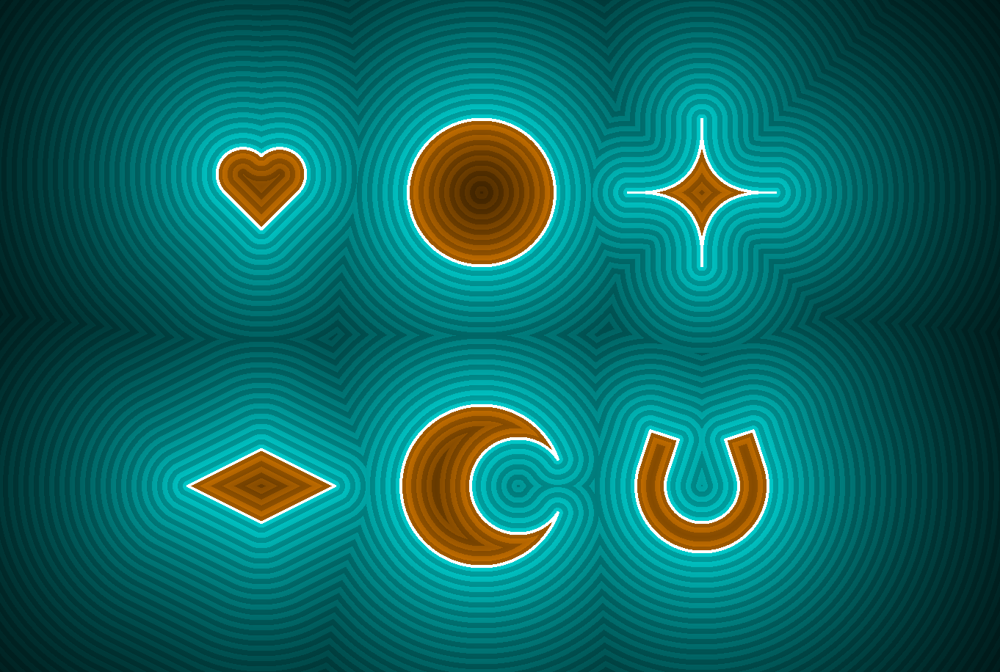

This write up is under construction, come back soon for more :)
See the code here: [https://github.com/usedhondacivic/ThreeJS-Raymarcher](https://github.com/usedhondacivic/ThreeJS-Raymarcher)

*Warning: Some demos on this page are graphically demanding. I recommend enabling GPU acceleration for your web browser for the best experience.*

<iframe src="https://michael-crum.com/ThreeJS-Raymarcher/mandlebulb" title="Raymarching Demo"></iframe>
> *Click and drag to rotate, scroll to zoom, right click to pan.*

> [See demo full screen](https://michael-crum.com/ThreeJS-Raymarcher/mandlebulb)

## What is Ray Marching?

You might be familiar with ray tracing, ray marching’s better known cousin. Ray tracing is a rendering process that uses math to simulate light bouncing around a scene before entering the camera. By computing the path light takes to enter each pixel of the screen, we can determine the color of that pixel based on material properties and lighting. For a simple one file demo of ray tracing, check out [my Javascript implementation](https://michael-crum.com/Js-Raycaster-V1/). 

Ray tracing gives stunning results, but is exceptionally computationally expensive. The main issue lies in the time complexity of ray intersection math, which must be performed many times for each pixel. 

Ray marching follows the same concept as ray tracing (following rays through space), but lowers the load through some computational cleverness.

I'll first walk through the theoretical basis for ray marching before finishing the article talking about my implementation.

### Signed Distance Fields (SDFs)

If computing exact ray-world intersections is too costly, what are our options? Ray marching uses an iterative approach based on Signed Distance Fields (SDFs). Instead of computing an exact intersection, the ray marching algorithm queries the lowest distance between a point and any location on an object. Outside of the object this value is > 0, inside it is < 0, and it is equal to 0 on the border.

> *An example of signed distance fields for various shapes*

Once we know the minimum distance to an object, we can safely step along any ray by that amount and not risk intersecting it. Stepping along the ray yields a new point, from which we can find a new minimum distance, step along the ray once more, and repeat.

The demo below shows the ray marching process for one ray sweeping a 2D scene. Each blue dot represents the end of one "step", and each ring shows the minimum distance from that point to the scene. Once the distance to the scene is below a threshold, we say we have hit the object and return.

<iframe src="https://michael-crum.com/ThreeJS-Raymarcher/2d_demo.html" title="2D Demo"></iframe>

> [See demo full screen](https://michael-crum.com/ThreeJS-Raymarcher/2d_demo.html)

SDFs are remarkably efficient, even for many shapes that appear complicated at first glance. Check out [Inigo Quilez's site](https://iquilezles.org/articles/distfunctions/) giving SDFs for a huge number of primitives.

### Combining SDFs

One useful feature of SDF's is how simple they are to combine. The simplest operation is a union, which represents the area inside of either of two shapes. We can find the union of two SDF's by taking the minimum of their two distance fields. This makes sense intuitively as we only care about the minimum distance to any object in the scene.

<pre>
<code class="language-js">
function union(x,y){
    return min(rectangle.sdf(x, y), circle.sdf(x, y))
}
</code>
</pre>

We can also find the intersection of two shapes, defined as the shared area or overlap. In terms of SDFs, we want the area where the SDF of both shapes is < 0. We can find this by taking the max of the two.

<pre>
<code class="language-js">
function intersect(x,y){
    return max(rectangle.sdf(x, y), circle.sdf(x, y));
}
</code>
</pre>

Finally, we can subtract one shape from another. This comes curtesy of the "signed" part of SDF. A signed distance field is positive outside the shape and negative inside of the shape. By negating the SDF of a shape we can turn it inside out. Taking the intersection of an inside-out shape with another primitive is equivalent to subtracting the first from the second.

<pre>
<code class="language-js">
function subtract(x,y){
    return max(rectangle.sdf(x, y), -circle.sdf(x, y));
}
</code>
</pre>

You can see all three operations in the demo below.

<iframe src="https://michael-crum.com/ThreeJS-Raymarcher/2d_demo_combining.html" title="2D Demo"></iframe>

> [See demo full screen](https://michael-crum.com/ThreeJS-Raymarcher/2d_demo_combining.html)

Another popular and immensely satisfying method is to interpolate between SDFs. This gives the effect of melting the primitives together, and is called a smooth union.

<iframe src="https://michael-crum.com/ThreeJS-Raymarcher/2d_interp.html" title="2D Demo"></iframe>

> [See demo full screen](https://michael-crum.com/ThreeJS-Raymarcher/2d_interp.html)

The code to achieve a smooth union is simple and shown below (courtesy of [Inigo Quilez](https://iquilezles.org/articles/smin/)).

<pre>
<code class="language-clike">
float opSmoothUnion( float d1, float d2, float k ) {
    float h = clamp( 0.5 + 0.5*(d2-d1)/k, 0.0, 1.0 );
    return mix( d2, d1, h ) - k*h*(1.0-h); 
}
</code>
</pre>

This implementation is a polynomial interpolation, with the "roundness" of the union controlled by factor k.

### Infinite Repetition

### Ambient Occlusion and Glow

### Fractal Distance Fields

## My Implementation

### Using Three.js and GLSL

### Pixel Shaders

## More Resources