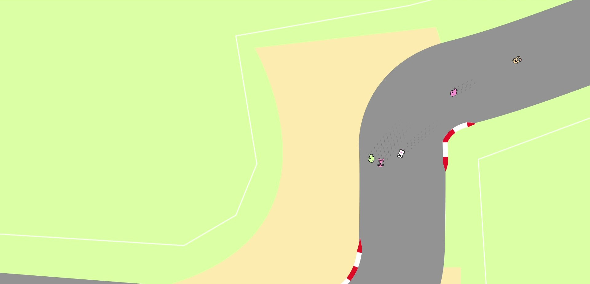

## WIP

This write up is under construction, come back soon :)

While you're waiting, you can [try the game here](http://spinout.eba-njr4i9hj.us-west-2.elasticbeanstalk.com/)

## Project Introduction

Inspired by the .io online multiplayer game boom, Spinout is my exploration of browser based online multiplayer gaming. I wanted take the traditional racing game experience and translate it into a stylized and chaotic experience perfect for the online gaming culture. This article a walkthrough of how I achieved that goal, complete with all the trials and tribulations along the way. 

## Modeling a Car for Maximum Fun

I started the design process with the player's car. A simplified model of the car's state consists of 

$$
[ x, y, v, \theta]
$$

Where $v$ is the car's forward velocity and $\theta$ is the cars heading with respect to the screen coordinate system. When the car moves forward at velocity $v$, simple trigonometry shows that the new state of the car will be

$$
[x + v*dt*\cos{(\theta)}, y + v*dt*\sin{(\theta)}, v, \theta]
$$

*insert demo*

In physical terms, this represents a car that experiences no forces orthogonal to its velocity whatsoever. This means it can perform infinitely sharp turns and move instantaneously in any direction. While this would be ideal for a real race car driver (until they die from the g-forces), its doesn't lead to fun gameplay. Perfect control doesn't lend itself to mastery or chaotic games, so we need to update the formula a bit.

To get a more accurate model of the car, we need to think about what is actually going on with a car. When the engine applies power to the wheels, it accelerates the car forward with respect to the cars body. Because the current heading of the body might not be in line with the heading of the velocity, we need to represent velocity as a vector as well .

### Car Collisions

### Simulating Driving Surfaces

## Creating Maps

## Netcode

## Dockerization and Deployment to AWS

## Issues, Improvements, and Future Work