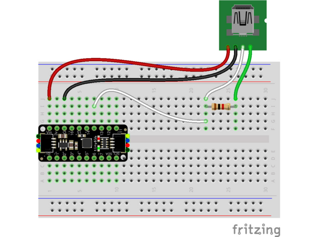

## Context: AVR and ATTiny

The AVR family of chips are built on the 8-bit RISC AVR Architecture. AVR became especially popular when it was selected as the main driver of the Arduino boards. The first circulated Arduino board, the Diecimila, used the ATmega168, and the ubiquitous Arduino Uno is based on the ATmega328P.

The ATtiny line is the baby of the AVR family. The chips are characterized by lower performance, memory, and pin options, but in return offer an absolutely miniscule footprint and price point. Because of this, they are often used in space and power constrained systems.

Unfortunately, easy programmability was one of the conveniences sacrificed for size. There is no bootloader, and the chip is far from plug and play. Instead, the chip must be programmed using the single wire UPDI protocol.

For my experiments, I've been using the [ATtiny1616 breakout board from Adafruit](https://www.adafruit.com/product/5690). It has extremely minimal additional hardware, which is perfect for learning the basics of the chip. Aside from the processor itself, there are a couple of other parts you need to get started with one of these boards.

## Parts List

* [ATtiny1616 breakout board](https://www.adafruit.com/product/5690) (or similar ATtiny chip)
* [Serial to Serial cable]() (for flashing the chip)
* 1k $\Omega$ resistor
* Prototyping breadboard

## Programmers, Hacks, and UPDI

Unlike fully featured boards like the Arduino Uno, most ATtiny breakout boards won't come with the hardware needed to flash new code. Instead you must use an [AVR Programmer](https://github.com/wagiminator/AVR-Programmer) to handle communication with the chip. The better programmers can cost a pretty penny, so a number of workarounds have been created.

The first is using a separate microcontroller as the programmer. By flashing an Arduino with [jtag2udpi](https://github.com/ElTangas/jtag2updi), the Arduino itself could then be used as a programmer for other AVR chips.

I didn't have an Arduino laying around, so I turned to a second option: [SerialUPDI](https://github.com/SpenceKonde/AVR-Guidance/blob/master/UPDI/jtag2updi.md#jtag2updi-never-heard-of-him). SerialUPDI uses a standard [USB to Serial cable](https://www.adafruit.com/product/954) and a single 1k $\Omega$ resistor to program over UPDI directly from your computer. This option is dirt cheap and minimizes external components, so its the approach I recommend. 

On different parts of the internet, you'll see the resistor value as 4.7k $\Omega$ all the way to 10k $\Omega$. Don't be fooled! I spent many hours trying to get a 4.7k resistor to work, only to swap to a 1k resistor and immediately have my problems solved. Wire up your board is shown below:

Quoting directly from [the Adafruit page](https://learn.adafruit.com/adafruit-attiny817-seesaw/advanced-reprogramming-with-updi):

* USB to Serial cable power to ATtiny VIN (red wire)
* USB to Serial cable ground to ATtiny G (black wire)
* USB to Serial cable RX to 1K resistor (white wire)
* USB to Serial cable TX to 1K resistor (green wire)
* 1K resistor to ATtiny UPDI pin (white wire)

## Installing the Toolchain

If you're looking for some quick results, the current setup is enough to use the Arduino IDE (or platform IO) to program the chip. [See the instructions for Arduino here](https://learn.adafruit.com/adafruit-attiny817-seesaw/advanced-reprogramming-with-updi). However, I'm here to urge you to not go over to the dark side! If you are ok with the bloat associated with the Arduino framework, you almost certainly would be better off using a higher spec'd chip to begin with. To squeeze all the possible performance out of the ATtiny, you really need to program it bare metal.

The following steps are what I used to get my setup working. I am running `Ubuntu 22.04.3 LTS` on my system, so if you're running Windows or Mac you might need to use a different tutorial for this step ([or use Docker](https://hub.docker.com/_/ubuntu)).

## Writing a Makefile

## Hello World!

## Further Reading