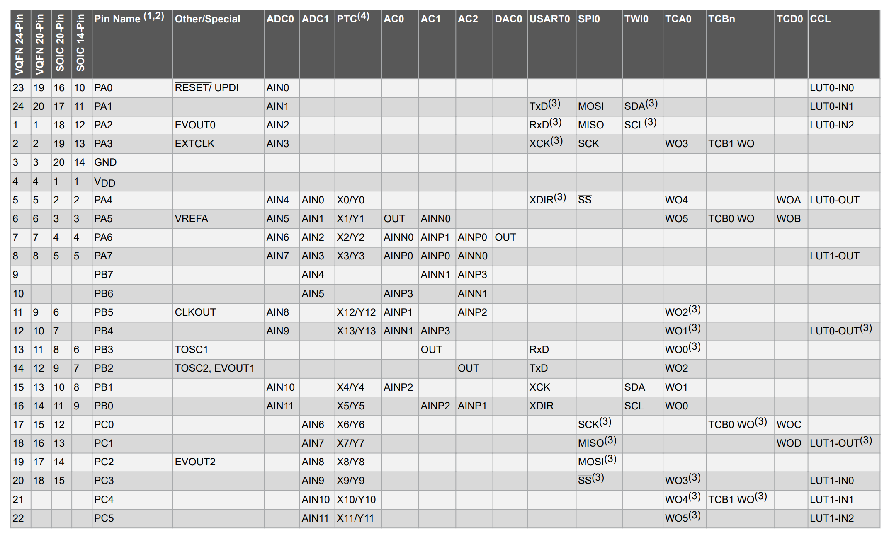

## Context: AVR and ATTiny

The AVR family of chips are built on the 8-bit RISC AVR Architecture. AVR became especially popular when it was selected as the main driver of the Arduino boards. The first circulated Arduino board, the Diecimila, used the ATmega168, and the ubiquitous Arduino Uno is based on the ATmega328P.

The ATtiny line is the baby of the AVR family. The chips are characterized by lower performance, memory, and pin options, but in return offer an absolutely miniscule footprint and price point. Because of this, they are often used in space and power constrained systems.

Unfortunately, easy programmability was one of the conveniences sacrificed for size. There is no bootloader, and the chip is far from plug and play. Instead, the chip must be programmed using the single wire UPDI protocol.

For my experiments, I've been using the [ATtiny1616 breakout board from Adafruit](https://www.adafruit.com/product/5690). It has extremely minimal additional hardware, which is perfect for learning the basics of the chip. Aside from the processor itself, there are a couple of other parts you need to get started with one of these boards.

## Parts List

* [ATtiny1616 breakout board](https://www.adafruit.com/product/5690) (or similar ATtiny chip)
* [USB to Serial cable]() (for flashing the chip)
* 1k $\Omega$ resistor
* Prototyping breadboard

## Programmers, Hacks, and UPDI

Unlike fully featured boards like the Arduino Uno, most ATtiny breakout boards won't come with the hardware needed to flash new code. Instead you must use an [AVR Programmer](https://github.com/wagiminator/AVR-Programmer) to handle communication with the chip. The better programmers can cost a pretty penny, so a number of workarounds have been created.

The first is using a separate microcontroller as the programmer. By flashing an Arduino with [jtag2udpi](https://github.com/ElTangas/jtag2updi), the Arduino itself could then be used as a programmer for other AVR chips.

I didn't have an Arduino laying around, so I turned to a second option: [SerialUPDI](https://github.com/SpenceKonde/AVR-Guidance/blob/master/UPDI/jtag2updi.md#jtag2updi-never-heard-of-him). SerialUPDI uses a standard [USB to Serial cable](https://www.adafruit.com/product/954) and a single 1k $\Omega$ resistor to program over UPDI directly from your computer. This option is dirt cheap and minimizes external components, so its the approach I recommend. 

On different parts of the internet, you'll see the resistor value as 4.7k $\Omega$ all the way to 10k $\Omega$. Don't be fooled! I spent many hours trying to get a 4.7k resistor to work, only to swap to a 1k resistor and immediately have my problems solved. Wire up your board is shown below:


Quoting directly from [the Adafruit page](https://learn.adafruit.com/adafruit-attiny817-seesaw/advanced-reprogramming-with-updi):

* USB to Serial cable power to ATtiny VIN (red wire)
* USB to Serial cable ground to ATtiny G (black wire)
* USB to Serial cable RX to 1K resistor (white wire)
* USB to Serial cable TX to 1K resistor (green wire)
* 1K resistor to ATtiny UPDI pin (white wire)

## Installing the Toolchain

If you're looking for some quick results, the current setup is enough to use the Arduino IDE (or platform IO) to program the chip. [See the instructions for Arduino here](https://learn.adafruit.com/adafruit-attiny817-seesaw/advanced-reprogramming-with-updi). However, I'm here to urge you to not go over to the dark side! If you are ok with the bloat associated with the Arduino framework, you almost certainly would be better off using a higher spec'd chip to begin with. To squeeze all the possible performance out of the ATtiny, you really need to program it bare metal.

The following steps are what I used to get my setup working. I am running `Ubuntu 22.04.3 LTS` on my system, so if you're running Windows or Mac you might need to use a different tutorial for this step ([or use Docker](https://hub.docker.com/_/ubuntu)).

The basic setup uses `gcc-avr` to compile and build the executable for the code, then passes the file to `avrdude` to flash the microcontroller.

If your lucky (and using a more common chip like the ATtiny85), then all you need to do is run

```bash
sudo apt-get update
sudo apt-get install gcc-avr binutils-avr avr-libc gdb-avr avrdude
```

However, if you're programming the ATtiny1616 you're going to run into problems. The first is with `avrdude`. At the time of writing, `apt-get` will install an ancient `avrdude` version that isn't compatible with SerialUPDI. Instead, we need to compile and install from source. First run

```bash
sudo apt-get remove avrdude
```

then follow [the instructions from the `avrdude` Github](https://github.com/avrdudes/avrdude/wiki/Building-AVRDUDE-for-Linux).

The second problem is with `gcc-avr`. The version installed with `apt-get` is 5.3, but the configuration files for the ATtiny1616 aren't included until version 8.0. If you try to compile targeting the ATtiny1616 using 5.3 you'll get the error:

```
usr/lib/gcc/avr/5.4.0/../../../avr/bin/ld: cannot find crtattiny1616.o: No such file or directory
```

Again, we need to build from source. This compilation is much beefier than `avrdude`, but luckily [Zak Kemble provides builds on his website](https://blog.zakkemble.net/avr-gcc-builds/). He also provides a script to build from source if you don't trust binaries from the internet.

After navigating to the directory you want to store the tool in (maybe `/opt/`), download the relevant file using

```
wget https://github.com/ZakKemble/avr-gcc-build/releases/download/v12.1.0-1/avr-gcc-12.1.0-x64-linux.tar.bz2
```

Alternatively you could download using the website and move the file. Next, we have to extract the archive using

```bash
tar -xf avr-gcc-12.1.0-x64-linux.tar.bz2
```

and add the executables to PATH with

```bash
export PATH=~/avr-gcc-12.1.0-x64-linux/bin:$PATH
```

## Pinging Your Chip

To test your setup, now is a good time to see if you can communicate with your microcontroller. Try running the following command:

```bash
sudo avrdude -c serialupdi -p t1616 -P "/dev/ttyUSB0" -b 57600 -v -v -v
```

The options are as follows:

* `-c`: What programmer you are using. Run `avrdude -c ?` to see all options.
* `-p`: The name of your chip. Run `avrdude -p ?` to see all options.
* `-P`: Port used for programming. Run `avrdude -P ?s` to see all options.
* `-b`: Baud rate. I'm running on a lower baud rate because SerialUPDI can get unstable when run faster.
* `-v`: Verbose. Chain multiple times to get more details printed.

After a successful run, you should get the following output:

```
avrdude: AVR device initialized and ready to accept instructions
avrdude: device signature = 0x1e9421 (probably t1616)

avrdude done.  Thank you.
```

If you see this message it means your programmer is communicating, but it can't connect to the board:

```
avrdude serialupdi_initialize() [serialupdi.c:574] error: UPDI link initialization failed
avrdude main() [main.c:1401] error: initialization failed, rc=-1
        - double check the connections and try again
        - use -b to set lower baud rate, e.g. -b 28800
        - use -F to override this check
```

If your programmer isn't detected at all, you'll get this message:

```bash
avrdude: opening serial port ...
avrdude ser_open() [ser_posix.c:400] OS error: cannot open port /dev/ttyUSB0: No such file or directory
avrdude: serial port open failed!
avrdude main() [main.c:1280] error: unable to open port /dev/ttyUSB0 for programmer serialupdi
```

Make sure you've selected the right serial adaptor with the `-P` flag.

## Starter Project

Now that the toolchain is properly installed, we can create a first project. It will do the unthinkable: blink an LED.

To run the project, we'll need two files. Make a project directory and create the files "main.cpp" and "makefile" under that directory.

### Writing a Makefile

The compilation and upload process consists of many steps, and typing them out each time is cumbersome and prone to error. Instead, we can use a makefile to run the process for us. I based my makefile off [this video by The Mac Layer](https://www.youtube.com/watch?v=iKqLbbyPydI), but added comments and fuse writing functionality.

makefile:
```make
# Define variable that may change between projects
FILENAME = main
PORT = /dev/ttyUSB0
DEVICE = attiny1616
PROGRAMMER = serialupdi

# Clock speed my be provided for delays to be timed properly 
CLOCK = 20000000

# Baud rate for programming
BAUD = 115200

# Compile with options:
# - All warnings (-Wall)
# - Optimized for size (-0s)
# - Targeted to our mcu (-mmcu)
# - F_CPU defined as our clock speed (-DF_CPU)
COMPILE = avr-gcc -Wall -Os -mmcu=$(DEVICE) -DF_CPU=$(CLOCK)

default: compile upload clean

# Compile step
# file.cpp -> file.o -> file.elf -> file.hex
# Then print out the size of the binary
compile:
	$(COMPILE) -c $(FILENAME).cpp -o $(FILENAME).o
	$(COMPILE) -o $(FILENAME).elf $(FILENAME).o
	avr-objcopy -O ihex $(FILENAME).elf $(FILENAME).hex
	avr-size $(FILENAME).elf

# Upload step
# Flash the .hex file onto the chip
upload:
	avrdude -v -p $(DEVICE) -c $(PROGRAMMER) -P $(PORT) -b $(BAUD) -U flash:w:$(FILENAME).hex:i

# Remove intermediate files
clean:
	rm $(FILENAME).o
	rm $(FILENAME).elf
	rm $(FILENAME).hex

# Fuses are non-volitile settings that can be set by avrdude and persist between resets
# Setting fuse2 to 0x7e enables 20Mhz clock
# See page 34 of https://ww1.microchip.com/downloads/en/DeviceDoc/ATtiny1614-16-17-DataSheet-DS40002204A.pdf
fuse:
	avrdude -v -p $(DEVICE) -c $(PROGRAMMER) -P $(PORT) -b $(BAUD) -U fuse2:w:0x7e:m
```

### Hello World!

Before we can flash the microcontroller, we need some code! Heres a quick program to blink an LED, adapted from [this tutorial](https://www.instructables.com/Honey-I-Shrunk-the-Arduino-Moving-from-Arduino-t/) to work on the ATtiny1616. The breakout board I'm using has an active low LED on pin 12, which this lovely [excerpt of the datasheet](https://ww1.microchip.com/downloads/en/DeviceDoc/ATtiny1614-16-17-DataSheet-DS40002204A.pdf) reveals is mapped to pin 0 of PORTC.



You'll have to change the pin if you use a different chip / breakout board.

main.cpp:
```cpp
#include <avr/io.h>
// F_CPU frequency is defined in the makefile
#include <util/delay.h>

// LED is on pin 0 of PORTC
#define LED 0
#define DELAY_MS 500

int main()
{
    uint8_t high = 0;
    uint16_t ms = 0;

    // Use MCLKCTRLB to disable the clock divider to get a 20 MHz clock
    // MCLKCTRLB is under CCP (configuration change protection), so we
    // have to write 0xD8 to the CCP register before we change it.
    CCP = 0xD8;
    CLKCTRL_MCLKCTRLB &= ~(1);

    // setup LED pin for output in port C's direction register and set LED pin LOW
    PORTC_DIR |= (1 << LED);
    PORTC_OUT &= ~(1 << LED);

    while (1)
    {
        // Toggle pin 0
        PORTC_OUT ^= PIN0_bm;

        _delay_ms(500);
    }

    return 0;
}
```

## Conclusion

And thats it! Welcome to the brutal (but rewarding) world of AVR programming.