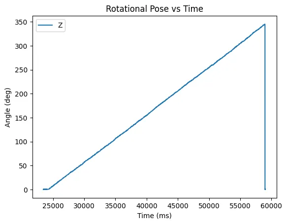
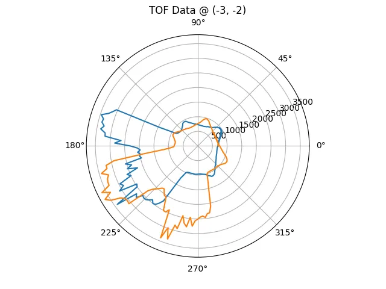

## Introduction

Roboticists are constantly attempting to do more with less. Computers, actuators, and sensors are never as fast, strong, or accurate as you would like. Working within these restrictions necessitate clever design, leading to interesting and elegant solutions. This semester I explored these requirements in the extreme, squeezing every bit of performance I could out of a toy car.

I'll first cover the physical and electrical modifications I made to the car, then get into the fun applications and the software algorithms that enabled them.

Note that this article is a massively abbreviated version of my [full build log](https://michael-crum.com/FAST-ROBOTS-2023/intro/), and primarily serves as an overview. For the real technical details, check out the full build log (linked above) and [the source code](https://github.com/usedhondacivic/FAST-ROBOTS-2023).

## Brain Surgery on a Car  

Electrically a toy car is very simple. My car uses one motor per side, connected to a microcontroller for converting data from a remote control into speed commands. For complicated processing and communication, the integrated controller is completely inadequate. I replaced it with the beefier [SparkFun Artemis Nano](https://www.sparkfun.com/products/15443) microcontroller, boasting a 48Mhz clock, 1MB flash, 384k RAM, and built in Bluetooth. The Artemis provides plenty of clock cycles and greatly simplifies my communication solution.

To control the motors, I used two [dual channel motor drivers](https://www.digikey.com/en/products/detail/pololu-corporation/2130/10450426), using two channels per motor to get 2.4 A peak current output. For sensing, I chose a [9 Degree of Freedom IMU](https://www.mouser.com/ProductDetail/SparkFun/SEN-15335?qs=uwxL4vQweFMcls1MYZT00A%3D%3D) and two [Time of Flight sensors](https://www.pololu.com/product/3415) rated for 4 meters of range.

The sensor peripherals communicate over I2C with the SparkFun QWIIC connector system. QWIIC is a standardized connector specifically for I2C, making prototyping plug and play.

After cutting out the included control hardware, I soldered the motor leads into my motor drivers and wired the peripherals into the artemis. Two 3.7V 850mAh LiPo batteries provide power, one dedicated to the motors and the other to the control electronics. Isolating the power source minimizes electromagnetic interference between the motors and sensors, a common issue when using brushed (or really any) motors.


> *The car's electronics installed, featuring my scribbled labels*

I also designed and 3D printed a guard to protect the ToF sensors from inevitable crashes.


> *The guard for the ToF sensors*

The upgraded car is a durable and highly capable robotics platform for well under $100.

## Software Stack

The Artemis Nano is compatible with the Arduino Core's wide variety of libraries and drivers. The ToF sensors and IMU have drivers from their vendors, and the motor drivers are easily controlled over PWM. Similarly, the Bluetooth Low Energy (BLE) module on the Artemis is supported by an Arduino Core library.

The Artemis is a wonderful little powerhouse, but for computationally expensive tasks it's just not fast enough. For the really heavy lifting, I chose to offload data to my laptop over BLE, compute the relevant values using Python, then send them back. For Python-side BLE communication I used the Bleak module. I also utilized the Python usual suspects for computation and graphing, namely Numpy and Matplotlib.

## Software Basis

Before getting into the cool applications, I want to cover some software techniques that enable the car to function. These techniques are ubiquitous in robotics and you'll run across them often, so they're worth a quick recap.

### Sensor Fusion

On the best of days data from cheap sensors is noisy and unreliable. On a bad day, like being placed directly next to two brushed motors, they can become downright unusable.

To combat the noise associated with individual readings, roboticist use a technique called sensor fusion. Sensor fusion combines two or more readings to generate a more accurate final signal. A classic example (and the one I implemented) is combining accelerometer and gyroscope readings to get a measure of rotation.

First off, how do you measure rotation with an accelerometer? Earths gravitational field causes a downward acceleration of $9.81 m/s^2$ on all objects, which is also measured by the accelerometer. By determining the direction of gravitational acceleration relative to the accelerometer you can find the accelerometers pitch and yaw.

Accelerometers are plagued by high frequency noise leading to unreliable single point readings. However, the readings are relative to the global reference frame (the direction of gravity) and therefore will be centered on the true value on average.

 On the other end of the spectrum, gyroscopes have almost no noise but drift slowly over time. We can think of this as extremely low frequency noise, $f=0$. What we really want is our signal to have the 'center' from the accelerometer data combined with the low noise from the gyroscope.

The filter that gives this effect is called a complementary filter. The basic operating principle is applying a high-pass filter to the gyroscope (allowing for sudden changes but filtering out drift over time) and a low-pass filter to the accelerometer (maintaining the true center relative to gravity while removing high frequency noise) and summing them.

Below is the code for implementing such a filter:

```cpp
// Time since last read
float dt = (float)(millis() - sensor_readings.gyro.stamp) / 1000.0; 

// Compute the accel roll and pitch from gravitational acceleration
float roll = atan2(sensor_readings.accel.y, sensor_readings.accel.z) * (180.0 / 3.14);
float pitch = atan2(sensor_readings.accel.x, sensor_readings.accel.z) * (180.0 / 3.14);

// Mathematically equivalent to low passing accel and high passing gyro
float gyro_favor = 0.98;
pose.rot.x = (gyro_favor) * (pose.rot.x + myICM.gyrX() * dt) + (1.00 - gyro_favor) * (roll);
pose.rot.y = (gyro_favor) * (pose.rot.y - myICM.gyrY() * dt) + (1.00 - gyro_favor) * (pitch);
// We cannot compute yaw from accel because the z axis is parallel to gravity
pose.rot.z = sensor_readings.gyro.z;
```


This graph shows the computed rotation around the X and Y axes. The accelerometer is noisy (blue and orange) and the gyro drifts over time (dark green and mint), yet the complimentary output rejects noise while staying centered on the accelerometer data (purple and red).

### PID Control

Another common problem in robotics is making an actuator go to a position (and stay there). As a motivating example, imagine you want to make the car turn exactly 90 degrees to the left.

The microcontroller only has authority over the PWM signals it sends to the motors. This _very_ roughly equates to velocity, but is influenced by a variety of factors (friction, load, battery voltage) that make the approximation unreliable. So what motor voltages should the controller send to get the resulting rotation?

Lets first define some terms. The error (E) is equal to the set point (where we want to go) minus the measured value. If we want the robot at 90 degrees and it's at 0 degrees, the error would be 90.

A first attempt approach is to make make the output proportional to the error. That way the further away the robot is from the set point, the more aggressively it to correct. This is known as a proportional gain, meaning the output is the error multiplied by some constant gain (call it $p$):

$$
output = p \cdot E 
$$

That seems reasonable, lets try it out:


As you can see, the P gain alone is not sufficient. The system either reaches a state where it oscillates around the set point, or is over damped and never reaches it.

Lets add another term. Adding the integral of the error works to "push" an over damped system towards the set-point. This term increases in strength the longer the robot is away from the set-point. This term is called the integral gain, and is denoted by $i$.

$$
output = p \cdot E + i \cdot \int_{0}^{t} E \cdot dt
$$

The longer we're in the wrong place the stronger the response. Again, this makes sense logically.


Now were getting somewhere. The position reaches the set point quickly and doesn't overshoot. But we can do even better.

Lets add one more term, this time proportional to the rate of change of the error. The derivative (or $d$) term counteracts rapid change in the error, dampening oscillations. This allows for higher P and I gains and therefore better rise time. The equation now becomes:

$$
output = p \cdot E + i \cdot \int_{0}^{t} E \cdot dt - d \cdot \frac{dE}{dt}
$$

Note that the derivative term is often omitted in low cost systems like my own. Due to the noise in cheep sensors the derivative of the measurement is often meaningless unless low passed.


Together the p, i, and d terms form PID control, a common control scheme for robotic systems.

Here's my PID controller implementation in C++, written as a class to make it portable for other projects.

```cpp
class PID_CONTROLLER {
private:
  double p;
  double i;
  double d;

  double integrator = 0;
  double integrator_cap = 1000;
  double z_prev = NULL;
  unsigned long last_time = NULL;

  int sample_rate_ms = 1;  //1khz

public:
  double output = 0;

  PID_CONTROLLER() {
    p = 0;
    i = 0;
    d = 0;
  }

  PID_CONTROLLER(double _p, double _i, double _d) {
    p = _p;
    i = _i;
    d = _d;

    if (_i != 0) {
      integrator_cap = 1 / i;
    }
  }

  void step(double u, double z) {
    unsigned long now = millis();
    if (z_prev == NULL) {
      z_prev = z;
    }
    if (last_time == NULL) {
      last_time = millis();
    }
    int dt = now - last_time;
    if (dt > sample_rate_ms) {
      double err = u - z;

      integrator += err;

      integrator = max(-integrator_cap, min(integrator_cap, integrator));

      double dz = z - z_prev;
      double der = -dz / dt;

      last_time = millis();
      z_prev = z;

      output = p * err + i * integrator + d * der;
    }
  }

  void set_gains(double _p, double _i, double _d) {
    p = _p;
    i = _i;
    d = _d;
  }

  void set_p_gain(double _p) {
    p = _p;
  }

  void set_i_gain(double _i) {
    i = _i;
  }

  void set_d_gain(double _d) {
    d = _d;
  }

  void reset(){
    z_prev = NULL;
    last_time = NULL;
    integrator = 0;
    output = 0;
  }
};
```

I also implemented some bells and whistles like integrator wind up control and derivative on measurement. I won't go into these techniques here, but a quick google search will yield some great explanations.

### The Rest of the Setup

The code to deal with readings sensors, transmitting data, executing routines, plotting data, ect is long and not all that interesting. If you care about those details, read the [full build log](https://michael-crum.com/FAST-ROBOTS-2023/intro/) and the [source code](https://github.com/usedhondacivic/FAST-ROBOTS-2023).

## Mapping the Surroundings

Ok now we're ready for the juicy stuff. How about mapping out a room?

Using a PID controller as described above, I made the robot track an angular velocity of 10 degrees / s. Given the sensor's delay of 150 ms per reading, this results in 2 degrees per reading.

<iframe width="560" height="315" src="https://www.youtube.com/embed/0F4qw4jbwCE" title="YouTube video player" frameborder="0" allow="accelerometer; autoplay; clipboard-write; encrypted-media; gyroscope; picture-in-picture; web-share" allowfullscreen></iframe>

> *The high octane thrills of spinning in place*



> *The rotational pose of the car over time*



> *Data from one reading, plotted against the angle of the reading on a polar graph*

Obstacles prevent the robot from seeing the entire room in one reading. Instead, I combined data from five individual readings to get a map of the whole space.

The recorded TOF readings are relative to the sensor's reference frame and must be transformed into the world frame. This is simple to achieve with some linear algebra.

To get from the sensor frame to the robot frame requires a rotation (the 20 degree skew) and a translation (the TOF are mounted to the front of center). Then we can go from the robot's frame to the inertial (world) frame through a second rotation and translation.

The sensor frame into the robot frame is calculated:

$$
\begin{bmatrix}
x_{robot} & y_{robot} 
\end{bmatrix}= 
\begin{bmatrix}
d \cdot cos(\pm 20) + 70 & d \cdot sin(\pm 20)
\end{bmatrix}
$$

Where d is the distance, or TOF reading, and 70 comes from how far forward the sensors are on the robot (70 mm).

From the robot frame to the inertial frame, I used the following transformation matrix: 

$$
\begin{bmatrix}
x_{world} \\
y_{world} \\
1
\end{bmatrix}=
\begin{bmatrix}
cos(R_{\theta}) & -sin(R_{\theta}) & R_x \\
sin(R_{\theta}) & cos(R_{\theta}) & R_y \\
0 & 0 & 1
\end{bmatrix}
\begin{bmatrix}
x_{robot} \\
y_{robot} \\
1
\end{bmatrix}
$$

Where R represents the robots coordinates in world space.

The result is decent map of the room! Not bad for a little car.


_real_rotated.webp)

> *The actual room vs the generated map*

## Localization

Now that we have a map of our room, can we use it to figure out where the robot is within it? This is a common problem in robotics known as localization.

### The Bayes Filter

Because the robot is unsure of its actual position, it would be unwise to presume one location. Instead, modern robotics uses probabilities to generate both an informed guess at the true state. As a side effect, a measure of uncertainty in the guess is also generated. By understanding its possible states and their associated likelihood, the robot can make informed decisions about its next move.

One such algorithm is known as the Bayes Filter, and is the basis for most modern probabilistic approaches. Quick warning: the following section is notation heavy and requires a working understanding of statistics. Feel free to jump to the next section if you just care about the implementation.

Lets define the problem more rigorously. For localization, our goal is to find the x position, y position, and rotation of the car. Together these quantities are called the "pose". Let $x_t$ represent the state at position $t$, which could be any pose in the room.

$$
x_t = \begin{bmatrix}
x \\
y \\
\theta
\end{bmatrix}
$$

Every possible pose $x_t$ has an associated likelihood that it is the true pose of the robot. The distribution of likelihood across the possible poses is known as the probability distribution or belief distribution and is denoted $bel(x_t)$. Initially $bel(x_t)$ is uniform (the same for all $x_t$) because we have no knowledge about the location of the car (it's equally likely to be anywhere).

While executing code on the robot, we give it a series of commands. From these commands, we can make an educated guess about where the robot will end up. That is to say if the robot is in pose $x_{t-1}$ and we give it commands $u_t$, we can denote the probability of the car arriving of pose $x_t$ as

$$
p(x_t | u_t, x_{t-1})
$$

We represent the probability the car is at $x_{t-1}$ as $bel(x_{t-1})$. Making the simplifying assumption that the above probability and $bel(x_{t-1})$ are independent, the probability of both events occurring can be written as their product.

$$
p(x_t | u_t, x_{t-1}) \cdot bel(x_{t-1})
$$

Because the car might arrive at $x_t$ from any other pose $x_{t-1}$ the total probability of arriving at $x_t$ is the sum of the probability of it arriving from each location

$$
\overline{bel} (x_t) = \sum_{x_{t-1}} p(x_t | u_t, x_{t-1}) \cdot bel(x_{t-1})
$$

This is known as the prediction step. Because the robot doesn't always follow the commands it is given, the prediction step introduces more uncertainty into the distribution, with the upside of reshaping it to follow the expected direction of motion.

Sensor measurements reduced the uncertainty in the approximation by introducing new information. Let $z_t$ represent the sensor readings since the last update. Using a simulation of the room we can predict the sensor readings that would be generated in each state. Assuming the error in the readings is normally distributed, the probability of that state being correct $p(z_t|x_t)$ can be calculated when the sensors take a new reading. Integrating this result with the belief from the prediction step gives

$$
bel(x_t) = \eta \cdot p(z_t | x_t) \cdot \overline{bel} (x_t)
$$

The normalization factor $\eta$ adjusts the distribution to sum to 1, which is required to be a valid distribution.

This math shows that the probability distribution of the robot's pose can be calculated using only:

1. a model of the robots motion in response to command $u_t$
2. a model of the sensor's error
3. the distribution from the last iteration of the filter

This is a huge result, allowing the robot to convert individual sensor readings into high level understanding of its location.

### Python Implementation

Because it iterates over the entire state space, the Bayes Filter is computationally expensive. Instead of attempting to run it on the Artemis, my code transfers the sensor readings to my laptop to do the heavy lifting.

The python code listed bellow is specific to my setup and codebase, and requires heavy modifications to work on another system. Use it as an a example of how you might translate the theory from the previous section into code.

The compute_control function takes the movement over a time step and converts it into the control command that would have caused the motion:

```python
def compute_control(cur_pose, prev_pose):
    """
    Args:
        cur_pose  ([Pose]): Current Pose
        prev_pose ([Pose]): Previous Pose 

    Returns:
        [delta_rot_1]: Rotation 1  (degrees)
        [delta_trans]: Translation (meters)
        [delta_rot_2]: Rotation 2  (degrees)
    """
    
    cur_x, cur_y, cur_theta = cur_pose
    prev_x, prev_y, prev_theta = prev_pose
    
    degrees = np.degrees(np.arctan2(cur_y - prev_y, cur_x - prev_x))
    delta_rot_1 = loc.mapper.normalize_angle(degrees - prev_theta)
    delta_trans = np.sqrt((cur_pose[0]-prev_pose[0])**2+(cur_pose[1]-prev_pose[1])**2)
    delta_rot_2 = loc.mapper.normalize_angle(cur_theta - prev_theta - delta_rot_1)
    
    return delta_rot_1, delta_trans, delta_rot_2
```

This is useful because the robot never directly records its commands. I can instead observe the robots behavior and infer the commands after the fact.

These commands are used in the odometry model to predict the probability that the robot has reached a given state based on where it was previously and what it was commanded to do.

```python
def odom_motion_model(cur_pose, prev_pose, u):
    """
    Args:
        cur_pose  ([Pose]): Current Pose
        prev_pose ([Pose]): Previous Pose
        (rot1, trans, rot2) (float, float, float): A tuple with control data in the format 
                                                   format (rot1, trans, rot2) with units (degrees, meters, degrees)

    Returns:
        prob [float]: Probability p(x'|x, u)
    """
    
    rot1, trans, rot2 = compute_control(cur_pose, prev_pose) #actual movement
    rot1_u, trans_u, rot2_u = u #inputted movement

    rot1_prob = loc.gaussian(rot1, rot1_u, loc.odom_rot_sigma)
    trans_prob = loc.gaussian(trans, trans_u, loc.odom_trans_sigma)
    rot2_prob = loc.gaussian(rot2, rot2_u, loc.odom_rot_sigma)
    prob = rot1_prob*trans_prob*rot2_prob

    return prob
```

All of these predictions are integrated by the prediction step:

```python
def prediction_step(cur_odom, prev_odom):
    """ 
    Args:
        cur_odom  ([Pose]): Current Pose
        prev_odom ([Pose]): Previous Pose
    """
    
    u = compute_control(cur_odom, prev_odom)
    for x_prev in range(MAX_CELLS_X):
        for y_prev in range(MAX_CELLS_Y):
            for theta_prev in range(MAX_CELLS_A):
                if loc.bel[(x_prev, y_prev, theta_prev)] < 0.0001:
                    continue
                for x_cur in range(MAX_CELLS_X):
                    for y_cur in range(MAX_CELLS_Y):
                        for theta_cur in range(MAX_CELLS_A):
                            loc.bel_bar[(x_cur, y_cur, theta_cur)] += odom_motion_model(loc.mapper.from_map(x_cur, y_cur, theta_cur), loc.mapper.from_map(x_prev, y_prev, theta_prev), u)*loc.bel[(x_prev, y_prev, theta_prev)]
  
    loc.bel_bar = loc.bel_bar/np.sum(loc.bel_bar)
```

This step integrates the odometry prediction and the noise values associated with it to predict the new location and update beliefs accordingly.

Odometry is not enough to form an accurate prediction, so we update it with the data collected by the sensors:

```python
def sensor_model(obs, cur_pose):
    """ 
    Args:
        obs ([ndarray]): A 2D array consisting of the measurements made in rotation loop

    Returns:
        [ndarray]: Returns a 1D array of size 18 (=loc.OBS_PER_CELL) with the likelihood of each individual measurements
    """
    
    prob_array = []
    for i in range(18):
        prob_value_a = loc.gaussian(obs[i, 0], cur_pose[i, 0], loc.sensor_sigma)
        prob_value_b = loc.gaussian(obs[i, 1], cur_pose[i, 1], loc.sensor_sigma)
        prob_array.append(prob_value_a * prob_value_b)
    return prob_array
```

Finally the update step integrates the sensor data into the prediction from odometry. 

```python
def update_step():
    for x in range(0, MAX_CELLS_X):
        for y in range(0, MAX_CELLS_Y):
            for theta in range(0, MAX_CELLS_A):
                loc.bel[(x, y, theta)] = np.prod(sensor_model(loc.obs_range_data,mapper.get_views(x, y, theta)))*loc.bel_bar[(x, y, theta)]

    loc.bel = loc.bel/np.sum(loc.bel) 
```

### Results

*da results*

## Using Kalman Filters for Optimized Drifting

I'm still working on writing up this section! In the meantime, read [my lab report on the topic](https://michael-crum.com/FAST-ROBOTS-2023/lab_7/). It has all the juicy details but none of the proof reading and editing ;)

## Resources and Special Thanks

See [my github](https://github.com/usedhondacivic/FAST-ROBOTS-2023) for the full code.

This article is a massively abbreviated version of my [full build log](https://michael-crum.com/FAST-ROBOTS-2023/intro/). Check that out if you want more details on the build.

This robot was developed as part of ECE 4160: Fast Robots at Cornell University. My work builds off of course starter code and the work from past students. You can find all of their pages [here](https://cei-lab.github.io/FastRobots-2023/StudentPages.html). Special thanks to Professor Kirstin Petersen for running a fantastic class.