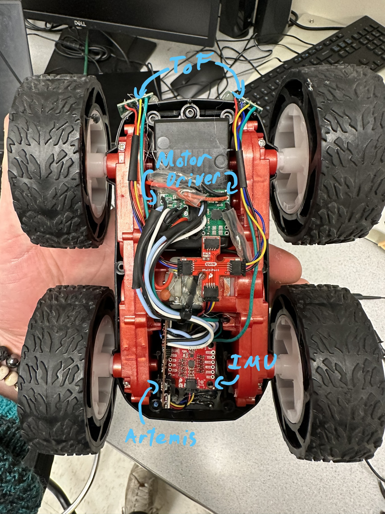
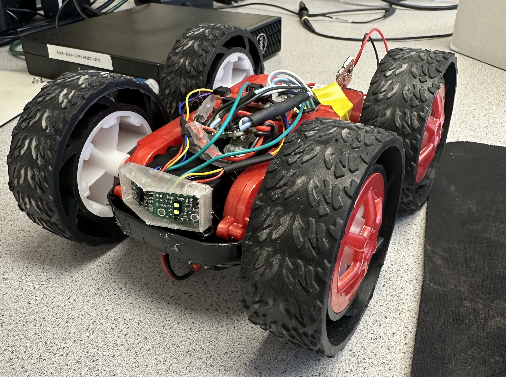
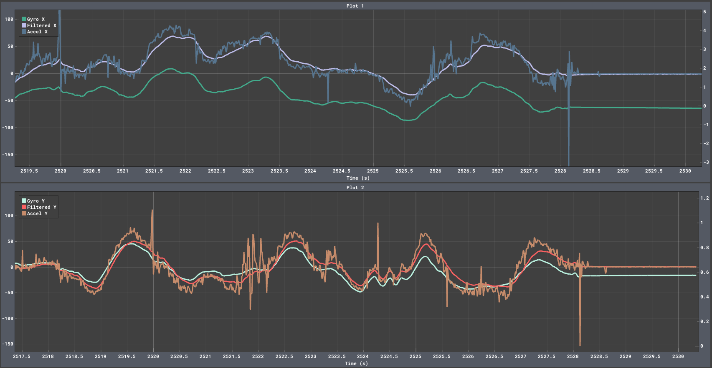
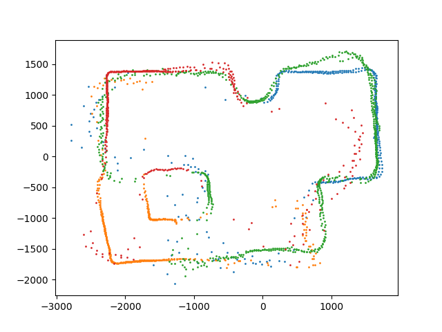

## Introduction

In robotics, we often find ourselves attempting to do more with less. Computers, actuators, and sensors are never as fast, strong, or accurate as we would like, so we need to use very clever design to make them achieve peak performance. The purpose of this project was taking this idea to the extreme: could I get reasonable results using the absolute bare minimum in hardware. And no, this totally had nothing to do with being a broke college student.

The platform I used for this robot is a cheap RC car from Amazon, designed for doing stunts. I'll first cover the physical and electrical modifications I made to the car, then get into the fun applications and the software algorithms that enabled them.

Note that this article is a massively abbreviated version of my [full build log](https://michael-crum.com/FAST-ROBOTS-2023/intro/), and primarily serves as an entertaining overview. For all of the real technical details, you should check out the full build log (linked above) and [the source code](https://github.com/usedhondacivic/FAST-ROBOTS-2023).

## Brain Surgery on a Car  

A toy car is electrically very simple. The one I'm using has one motor per side, connected to a microcontroller that converts information from the remote control into speed commands. For complicated processing and communication, the integrated controller is totally inadequate. I used the [SparkFun Artemis Nano](https://www.sparkfun.com/products/15443) microcontroller as a replacement, which boasts a 48Mhz clock, 1MB flash, 384k RAM, and built in Bluetooth. This gives me plenty of clock cycles to play with and greatly simplifies my communication solution.

A microcontoller is nothing with some peripherals, so I tricked out the car with some more gear. To control the motors, I used two [dual channel motor drivers](https://www.digikey.com/en/products/detail/pololu-corporation/2130/10450426), using two channels per motor to get 2.4 A output per motor. For sensing, I went for a [9 Degree of Freedom IMU](https://www.mouser.com/ProductDetail/SparkFun/SEN-15335?qs=uwxL4vQweFMcls1MYZT00A%3D%3D) and two [Time of Flight sensors](https://www.pololu.com/product/3415) rated for 4 meters of range.

The sensor peripherals all communicate over I2C, and I used the SparkFun QWIIC connector system that is built into the Artemis. QWIIC is just a dedicated connector and cables for I2C, but makes prototyping much quicker and more reliable.

After cutting the cables and removing the included control hardware, I soldered the motor leads into my motor drivers and wired all the peripherals into the artemis. Two 3.7V 850mAh LiPo batteries provide power, one dedicated to the motors and the other to the control electronics. Isolating the power source minimizes electromagnetic interference between the motors and sensors, a common issue when using brushed (or really any) motors.



> *The car's electronics installed, featuring my scribbled labels*

I also designed and 3D printed a guard to protect the ToF sensors from inevitable crashes.



> *The guard for the ToF sensors*

All together this package comes in at well under $100.

## Software Basis

I'll get to the cool applications soon, but first I want to cover some basic software techniques that enable the more complicated stuff that's coming up.

### Software Stack

The Artemis Nano is compatible with the Arduino Core, allowing use of a wide variety of libraries and drivers. The ToF sensors and IMU have drivers from their vendors, and the motor drivers are simple to interface with using PWM. Similarly, the Bluetooth Low Energy (BLE) module on the Artemis is supported by an Arduino Core library.

The Artemis is a wonderful little powerhouse, but for computationally expensive tasks it is just not fast enough. I instead offload data to my laptop over BLE, compute the relevant values using Python, then send them back. For Python-side BLE communication I used the Bleak module. The other Python heavy-lifters are the usual suspects, namely Numpy for computation and Matplotlib for plotting.

### Sensor Fusion

On the best of days, data from cheap sensors is noisy and full of errors. On a bad day, say when placed right next to two brushed EMI generating nightmares, they can become downright unusable.

To combat the noise associated with individual readings, roboticist use a technique called sensor fusion. Sensor fusion is combing two or more readings to generate a more accurate final signal. A classic example (and the one I implemented) is combining accelerometer and gyroscope readings to get a measure of rotation.

First off, how do you measure rotation with an accelerometer? Earths gravitational field causes a downward acceleration of $9.81 m/s^2$ on all objects, which is also measured by the accelerometer. By determining the direction of gravitational acceleration relative to the accelerometer you can find the accelerometers pitch and yaw.

Due to their design, accelerometers are plagued by high frequency noise leading to unreliable point readings. On the other end of the spectrum, gyroscopes have almost no noise but drift slowly over time. We can think of this as extremely low frequency noise, $f=0$. What we really want is our signal to have the correct 'center' from the accelerometer combined with the low noise from the gyroscope.

The filter that gives this effect is called a complementary filter. The basic operating principle is applying a high-pass filter to the gyroscope (allowing for sudden changes but filtering out drift over time) and a low-pass filter to the accelerometer (maintaining the true center relative to gravity) and summing them.

Below is the code for implementing such a filter:

```cpp
// Time since last read
float dt = (float)(millis() - sensor_readings.gyro.stamp) / 1000.0; 

// Compute the accel roll and pitch from gravitational acceleration
float roll = atan2(sensor_readings.accel.y, sensor_readings.accel.z) * (180.0 / 3.14);
float pitch = atan2(sensor_readings.accel.x, sensor_readings.accel.z) * (180.0 / 3.14);

// Mathematically equivalent to low passing accel and high passing gyro
float gyro_favor = 0.98;
pose.rot.x = (gyro_favor) * (pose.rot.x + myICM.gyrX() * dt) + (1.00 - gyro_favor) * (roll);
pose.rot.y = (gyro_favor) * (pose.rot.y - myICM.gyrY() * dt) + (1.00 - gyro_favor) * (pitch);
// We cannot compute yaw from accel because the z axis is parallel to gravity
pose.rot.z = sensor_readings.gyro.z;
```



As you can see from the graph, the accelerometer is noisy (blue and orange) and the gyro drifts (dark green and mint), yet the complimentary output rejects noise while staying centered on the accelerometer data (purple and red).

### PID Control

Another common problem in robotics is making a robot move to a set point. If you want the car to rotate to a certain position, you can't simply say "move to x angle". The only control the microcontroller has over the motion of the car is the voltage it sends to the motor (technically the PWM duty cycle, but effectively the voltage). So what motor voltages should the controller send to get the resulting rotation?

Lets first define some terms. The error (E) is equal to the set point (where we want to go) minus the measured value. So if we want the robot at 90 degrees and it's at 0 degrees, the error would be 90.

A first attempt is using a proportional gain, meaning the output is the error multiplied by some constant gain (call it $p$):

$$
output = p \cdot E 
$$

So the further away we are from the set point, the more aggressively we attempt to correct. That seems reasonable, lets try it out:


As you can see, the P gain alone is not sufficient. The system either reaches a state where it oscillates around the set point, or is over damped and never reaches it.

To fix these issues, lets add another term. This term increases in strength the longer the robot is away from the set point.

$$
output = p \cdot E + i \cdot \int_{0}^{t} E \cdot dt
$$

The longer we're not at the right place, the stronger the response. Again, this makes sense logically.


Now were getting somewhere. The position reaches the set point quickly and doesn't overshoot. But we can do even better.

Lets add one more term, this time proportional to the rate of change of the error. To dampen oscillations, the derivative (or d) term counteracts rapid change in the error. This dampens oscillations, allowing for higher P and I gains and therefore better rise time. The equation now becomes:

$$
output = p \cdot E + i \cdot \int_{0}^{t} E \cdot dt - d \cdot \frac{dE}{dt}
$$

Note that the derivative term is often omitted in low cost systems like my own. Due to the noise in cheep sensors, the derivative of the measurement is often meaningless unless put through a low pass filter.


Together the p, i, and d terms form PID control, a common control scheme for robotic systems.

Here's my PID controller implementation in C++, specifically for the Arduino environment I use to program the Artemis. It's written as a class so that multiple PID controllers can be created and updated concurrently.

```cpp
class PID_CONTROLLER {
private:
  double p;
  double i;
  double d;

  double integrator = 0;
  double integrator_cap = 1000;
  double z_prev = NULL;
  unsigned long last_time = NULL;

  int sample_rate_ms = 1;  //1khz

public:
  double output = 0;

  PID_CONTROLLER() {
    p = 0;
    i = 0;
    d = 0;
  }

  PID_CONTROLLER(double _p, double _i, double _d) {
    p = _p;
    i = _i;
    d = _d;

    if (_i != 0) {
      integrator_cap = 1 / i;
    }
  }

  void step(double u, double z) {
    unsigned long now = millis();
    if (z_prev == NULL) {
      z_prev = z;
    }
    if (last_time == NULL) {
      last_time = millis();
    }
    int dt = now - last_time;
    if (dt > sample_rate_ms) {
      double err = u - z;

      integrator += err;

      integrator = max(-integrator_cap, min(integrator_cap, integrator));

      double dz = z - z_prev;
      double der = -dz / dt;

      last_time = millis();
      z_prev = z;

      output = p * err + i * integrator + d * der;
    }
  }

  void set_gains(double _p, double _i, double _d) {
    p = _p;
    i = _i;
    d = _d;
  }

  void set_p_gain(double _p) {
    p = _p;
  }

  void set_i_gain(double _i) {
    i = _i;
  }

  void set_d_gain(double _d) {
    d = _d;
  }

  void reset(){
    z_prev = NULL;
    last_time = NULL;
    integrator = 0;
    output = 0;
  }
};
```

I also implemented some fun things like integrator wind up limiting and derivative on measurement. I won't go into these techniques here, but a quick google search will yield some great explanations.

### The Rest of the Setup

I also wrote huge amounts of code to deal with readings sensors, transmitting data, executing routines, plotting data, ect. If you care about any of that read the [full build log](https://michael-crum.com/FAST-ROBOTS-2023/intro/) and the [source code](https://github.com/usedhondacivic/FAST-ROBOTS-2023).

## Mapping the Surroundings

Ok now we're ready for the real juicy stuff. How about mapping out a room?


> *The final generated map*

I picked five locations that together combined allow the robot to see all parts of the room. At each location, the robot spins while concurrently taking readings from the ToF distance sensors. I can then use some math to convert the straight line sensor readings into world coordinates for the walls. Lets start with the spinning part.

Using a PID controller described above, I can make the robot track an angular velocity. I aimed for a resolution of 2 degrees per readings, and the sensors take readings in about 150 ms. Simple math shows that an angular velocity of 10 degrees per second yields the desired resolution.

## Localization

Now that we have a map of our room, can we use it to figure out where the robot is within it? This is a common problem in robotics known as localization.

### The Bayes Filter

Because we are unsure of the true position of the robot, it would be unwise to presume one location. Instead, modern robotics works with probabilities to generate both an informed guess at the true state and a metric of the certainty of that guess. The Bayes Filter is one such algorithm.

For localization, our goal is to find the x position, y position, and rotation of the car. Together these quantities are called the "pose". Let $x_t$ represent the state at position $t$, which could be any pose in the room.

$$
x_t = \begin{bmatrix}
x \\
y \\
\theta
\end{bmatrix}
$$

The probability distribution over every possible pose (also known as the belief distribution) is denoted $bel(x_t)$. Initially $bel(x_t)$ is uniform because we have no knowledge about the location of the car.

While executing code on the robot, we give it a series of commands. From these commands, we can make an educated guess about where the robot will end up. That is to say if the robot is in pose $x_{t-1}$ and we give it commands $u_t$, we denote the probability of the car arriving of pose $x_t$ as

$$
p(x_t | u_t, x_{t-1})
$$

We represent the probability the car is at $x_{t-1}$ as $bel(x_{t-1})$. Because the probability above and $bel(x_{t-1})$ are independent, the probability of both events is

$$
p(x_t | u_t, x_{t-1}) \cdot bel(x_{t-1})
$$

Because the car might arrive at $x_t$ from any other pose $x_{t-1}$ the total probability of arriving at $x_t$ is the sum of the probability from each location

$$
\overline{bel} (x_t) = \sum_{x_{t-1}} p(x_t | u_t, x_{t-1}) \cdot bel(x_{t-1})
$$

This is known as the prediction step. Because the robot doesn't always follow the commands it is given, the prediction step introduces more uncertainty into the distribution, with the upside of reshaping it to follow the expected direction of motion.

To reduce the uncertainty we need to account for sensor measurements. Let $z_t$ represent the sensor readings since the last update. Using a simulation of the room we can predict the sensor readings from each state. Assuming the error in the readings is normally distributed, the probability of that state being correct $p(z_t|x_t)$ can be calculated from real sensor data. Integrating this result with the belief from the prediction step gives

$$
bel(x_t) = \eta \cdot p(z_t | x_t) \cdot \overline{bel} (x_t)
$$

### Python Implementation

## Using Kalman Filters for Optimized Drifting

## Resources and Special Thanks

See a full listing of the code [here](https://github.com/usedhondacivic/FAST-ROBOTS-2023).

This article is a massively abbreviated version of my [full build log](https://michael-crum.com/FAST-ROBOTS-2023/intro/). Check that out if you want any of the specifics.

This robot was developed as part of ECE 4160: Fast Robots at Cornell University. My work builds off of course starter code and the work from past students. You can find all of their pages [here](https://cei-lab.github.io/FastRobots-2023/StudentPages.html), and I am so grateful for their help. Special thanks to Professor Kirstin Petersen for running a fantastic class.