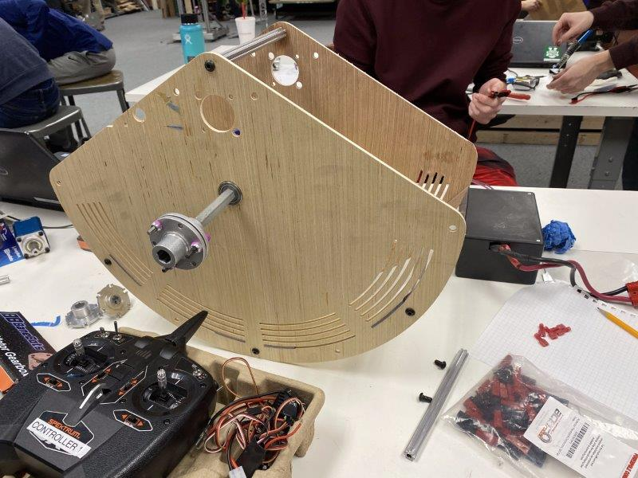
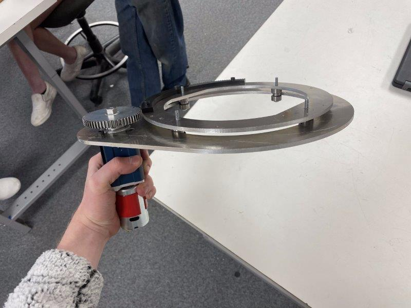
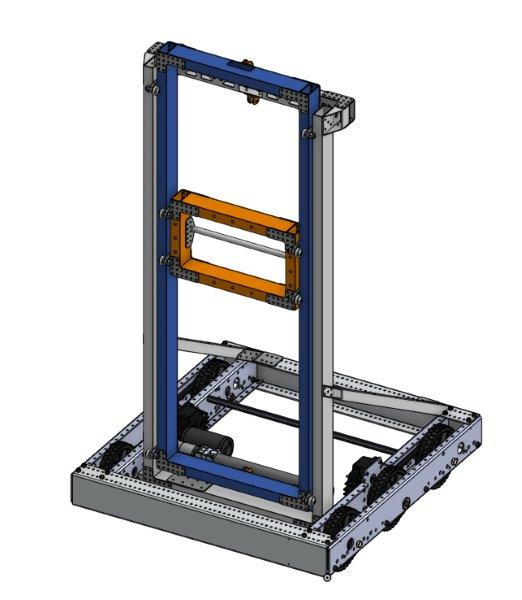

## Infinite Recharge: Game Overview
Shamelessly stolen from [Wikipedia](https://en.wikipedia.org/wiki/Infinite_Recharge):
> The Infinite Recharge game involves two alliances of three teams each, with each team controlling a robot and performing specific tasks on a field to score points. The game centers around a futuristic city theme involving two alliances consisting of three teams each competing to perform various tasks, including shooting foam balls known as Power Cells into high and low goals to activate a Shield Generator, manipulating a Control Panel to activate this shield, and returning to the Shield Generator to park or climb at the end of the match.

## My Responsibilities  
### Turreted shooter
My first project was design, fabrication, and control of the power cell shooter. 
Because of the unique characteristics of power cells, I wanted to test how they responded to different designs. I built an adjustable half-circle shooter to rapidly test performance with a variety of wheels, compressions, speeds, and launch angles.

From this data, we decided to shoot into the high goal from the trench run at about 60% power on the motors. This would limit the impact on the battery and give us flexibility with the range and wear. After testing a variety of motors, we landed on a single NEO Brushless motor on a 1:1.6 belt ratio. The NEO motors have great torque for their size, and their 6000 rpm free speed was perfect for our intended range.

With the basic shooter concept finalized, I began CADing a rotating platform to mount it on. Having a turreted shooter would be valuable for avoiding defense, make us more accurate, and make our cycles more efficient. Through researching other team's solutions to the problem, I settled on a simple bearing stack that would run along the inside of a piece of aluminum.
By placing four bearing stacks around the outside of a circle, they can move smoothly around a plate mounted to the frame. I added several removable sections of gear tooth to be attached to the turret head. I cut the pieces on our laser cutter and built a prototype.

  
> ##### Final turret design, cut in aluminum with delrin gear teeth

Once the prototype was verified, final parts were cut out of aluminum.

> ##### Shooter + turret final assembly

Next, I integrated the system with the rest of the robot. At this point, we had finalized the design for our hopper, and were just missing a way to transition the power cells from the hopper into the turret. I designed a kicker wheel to pull balls up against a curved piece of plastic and into the shooter, keeping the feed consistent. The design is based on bent sheet metal as much as possible, keeping fabrication simple and efficient.
The kicker wheel design worked well, and we were soon able to launch our first power cells.

> ##### Kicker wheel assembled in CAD  

The final touch was an adjustable launch angle. I designed the "hood" of our shooter to be actuated, allowing for high angle shots. The first design used a small pneumatic cylinder, but initial testing showed that it was too weak. To fix that problem, I designed a linkage in which two pieces of Delrin would "lock" in the upright position against the force of the ball, making it strong yet easily actuated by the pneumatic. The addition of the adjustable hood allowed us to shoot from anywhere on the field and gave us the flexibility to play as a forward or long shooter.

> ##### The hood back, then forward (pneumatic not shown in the CAD)  

## Intake
I designed a rapid prototype intake at the beginning of the season to give some less experienced team members a starting place to work from.

> ##### Early prototype of the intake (feat. Shalom)  

Due to numerous difficulties, I took back over the subsystem near the end of the build season.
I began design a roller intake, designed to grab power cells and pull them over the bumper and into the robot. Tests were promising, so I moved on to integration. The intake needed to swing fully into the frame perimeter while avoiding both the climber arms and the hopper. My design uses small pneumatic cylinders to retract and extend the intake, which folds over the hopper.
I decided to use a 775 redline on a 16:1 reduction to power the rollers. A 775 offered a perfect balance of power (jam resistance) and speed. I decided on a triple roller design because the initial two roller design was allowing power cells to escape out of the hopper.
We broke our first version at our local scrimmage, so I redesigned to create an intended point of failure along a row of rivets holding the intake onto the pivot arms. That way when the intake (inevitably) got abused, it would keep working and be easy to repair.
 
The final design was cut out of 1/4" Delrin and 1"x1" aluminum stock.

> ##### Final intake design in CAD

## Programming
To promote code consistency and longevity within the team, I created a framework that can be used modularly on future robots. The framework uses XML files to define the configuration of the motors, sensors, pneumatics, and other IO devices on the robot. These devices were automatically initialized and made available for routines written in files for each subsystem. This allowed us to reconfigure and tune variables in the code without inefficient redeploys.
I also introduced computer vision to the team. After struggling to create a custom raspberry pi based solution, we bought a Limelight camera for each robot. I created an algorithm that automatically targeted, set the flywheel speed, and shot a power cell at the press of a button from any range or angle.
All of my code can be found on [my GitHub](https://github.com/usedhondacivic/FRC-2020-Infinite-Recharge).
### Driving
This was my third year as a driver and I was able to participate in a local scrimmage and the Utah regional. At the Utah regional were chosen by the second seed alliance, but unfortunately lost the first round of playoffs in an upset.
  
  

  
> ##### The glorious 3648 drive team on the steps of the Maveric Center in Salt Lake City, UT

## Preseason Project: Elevator Bot
Before the season began, I experimented with the CAD program OnShape. I decided to model and build an elevator as practice before the real season. One of our mentors had recently bought a CNC router and was happy to help me fabricate the parts for my design. In just over four weeks, I designed and built a functional elevator robot with the help of a few friends. The elevator worked phenomenally, and it was the first subsystem to ever be produced by 3648 using computer-aided design.

    
     
    

> ##### The CAD model for the elevator bot next to the fabricated version

This project proved the feasibility of using CAD in our shop and paved the way for using CAD for design and rapid prototyping for the rest of the season.