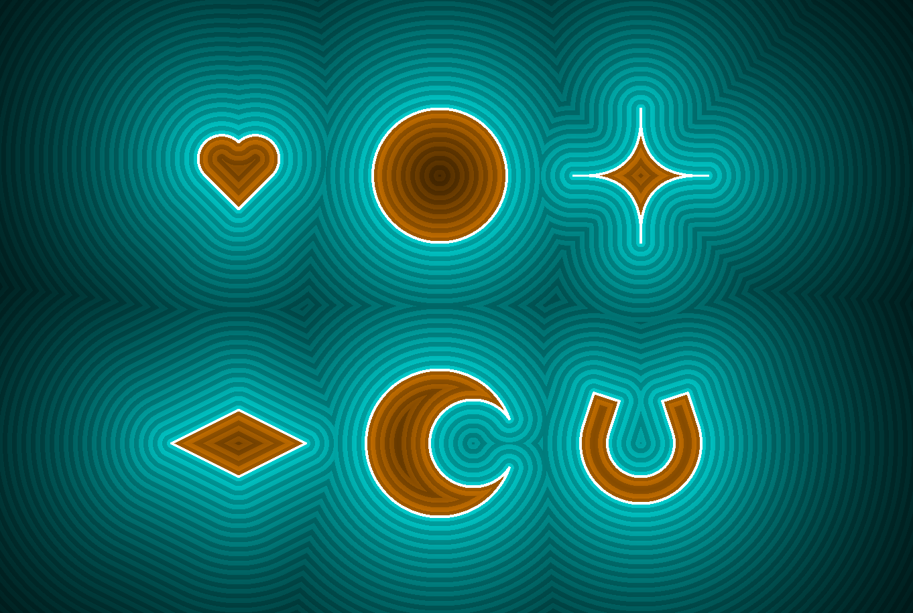
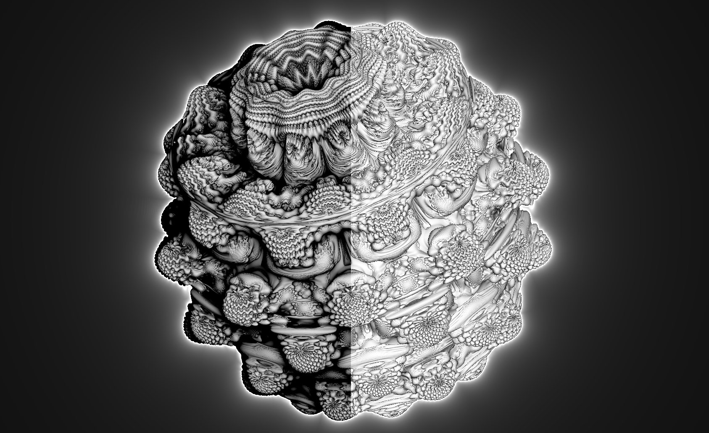

This write-up is under construction, come back soon for more :)
See the code here: [https://github.com/usedhondacivic/ThreeJS-Raymarcher](https://github.com/usedhondacivic/ThreeJS-Raymarcher)

*Warning: Some demos on this page are graphically demanding. I recommend [enabling GPU acceleration](https://www.amd.com/en/support/kb/faq/gpu-110) for your web browser for the best experience.*

<iframe src="https://michael-crum.com/ThreeJS-Raymarcher/mandlebulb" title="Raymarching Demo"></iframe>

> *The Mandlebulb, a 3D generalization of the Mandblebrot set.*
> 
> *Click and drag to rotate, scroll to zoom.* [See demo full screen](https://michael-crum.com/ThreeJS-Raymarcher/mandlebulb)

## What is Ray Marching?

You might be familiar with ray tracing, ray marching’s better-known cousin. Ray tracing is a rendering process that uses math to simulate light bouncing around a scene before entering the camera. By computing the path light takes to enter each pixel of the screen, we can determine the color of the pixel based on material properties and lighting. For a simple one-file demo of ray tracing, check out [my Javascript implementation](https://michael-crum.com/Js-Raycaster-V1/). 

Ray tracing gives stunning results, but is exceptionally computationally expensive. The main issue lies in the time complexity of finding the ray-world intersection, which must be performed many times for each pixel. 

Ray marching follows the same concept as ray tracing (following rays through space), but uses some computational cleverness to make the intersections easier to compute.

I'll first walk through the theoretical basis for ray marching before finishing the article by talking about my implementation.

### Signed Distance Fields (SDFs)

If computing exact ray-world intersections is too costly, what are our options? Ray marching uses an iterative approach based on Signed Distance Fields (SDFs). Instead of computing an exact intersection, the ray marching algorithm queries the lowest distance between a point and any location on an object. Outside of the object this value is > 0, inside it is < 0, and on the border it is equal to 0.



> *An example of signed distance fields for various shapes*

Once we know the minimum distance to an object, we can safely step along any ray by that amount and not risk intersecting it. Stepping along the ray yields a new point, from which we can find a new minimum distance, step along the ray once more, and repeat.

The demo below shows the ray marching process for one ray sweeping a 2D scene. Each blue dot represents the end of one "step", and each ring shows the minimum distance from that point to the scene. Once the distance to the scene is below a threshold, we say we have hit the object and return.

<iframe src="https://michael-crum.com/ThreeJS-Raymarcher/2d_demo.html" title="2D Demo"></iframe>

> *Ray marching a sweep of a 2D scene* [See demo full screen](https://michael-crum.com/ThreeJS-Raymarcher/2d_demo.html)

SDFs are remarkably efficient, even for many shapes that appear complicated at first glance. Check out [Inigo Quilez's site](https://iquilezles.org/articles/distfunctions/) giving SDFs for a huge number of primitives.

### Combining SDFs

One useful feature of SDFs is how simple they are to combine. The simplest operation is a union, which represents the area inside of either of two shapes. We can find the union of two SDFs by taking the minimum of their two distance fields. This makes sense intuitively as we only care about the minimum distance to any object in the scene.

```cpp
float union(vec2 p, float d1, float d2){
    return min(d1, d2);
}
```

We can also find the intersection of two shapes, defined as the shared area or overlap. In terms of SDFs, we want the area where the SDF of both shapes is < 0. We can find this by taking the max of the two.

```cpp
float intersect(vec2 p, float d1, float d2){
    return max(d2, d2);
}
```

Finally, we can subtract one shape from another. This comes courtesy of the "signed" part of the signed distance field. An SDF is positive outside the shape and negative inside of the shape. By negating the SDF of a shape we can turn it inside out. Taking the intersection of an inside-out shape with another primitive is equivalent to subtracting the first from the second.

```cpp
float subtract(vec2 p, float d1, float d2){
    return max(d2, -d2);
}
```

You can see all three operations in the demo below.

<iframe src="https://michael-crum.com/ThreeJS-Raymarcher/2d_sdf_combine.html" title="2D Demo"></iframe>

> [See demo full screen](https://michael-crum.com/ThreeJS-Raymarcher/2d_sdf_combine.html)

Another popular and immensely satisfying method is to interpolate between SDFs. This gives the effect of melting the primitives together and is called a smooth union.

<iframe src="https://michael-crum.com/ThreeJS-Raymarcher/2d_interp.html" title="2D Demo"></iframe>

> [See demo full screen](https://michael-crum.com/ThreeJS-Raymarcher/2d_interp.html)

The code to achieve a smooth union is simple and shown below (courtesy of [Inigo Quilez](https://iquilezles.org/articles/smin/)).

```cpp
float opSmoothUnion( float d1, float d2, float k ) {
    float h = clamp( 0.5 + 0.5*(d2-d1)/k, 0.0, 1.0);
    return mix( d2, d1, h ) - k*h*(1.0-h); 
}
```

This implementation is a polynomial interpolation, with the "roundness" of the union controlled by factor k.

This also works in 3D of course, as shown below.

```cpp
float power = 0.5;

float sceneSDF(vec3 samplePoint) {
    float sphere = sdSphere(samplePoint, 0.2);
    float box = sdBox(samplePoint + vec3(-0.6, 0.0, 0.0), vec3(0.3, 0.3, 0.3));
    float torus = sdTorus(samplePoint + vec3(0.7, 0.0, 0.0), vec2(0.3, 0.1))
    float d = opSmoothUnion(sphere, box, power);
    d =  opSmoothUnion(d, torus, power);
    return d;
}
```

<iframe src="https://michael-crum.com/ThreeJS-Raymarcher/3d_interp.html" title="2D Demo"></iframe>

> *Remember that you can click and drag to look around.* [See demo full screen](https://michael-crum.com/ThreeJS-Raymarcher/3d_interp.html)

### Infinite Repetition

With a ray tracer, intersections with each primitive in the scene must be independently calculated. This scales poorly with dense scenes (ie a field of blades of grass). With ray marching this problem can be trivialized using domain repetition.

Each step of the ray marching process calculates the distance to the scene from some point <code class="language-cpp">(x,y)</code>. In the language of SDFs, "repeating a shape" really means that the SDF of the shape is the same in two regions. One way of doing this is using the modulo operation. Replacing <code class="language-clike">(x,y)</code> with <code class="language-clike">(x % 5,y % 5)</code> causes the domain of the SDF to repeat every 5 units in the x and y direction, replicating the SDF infinitely without increasing the memory footprint of the scene.

As an example, check out this wonderfully textured infinite scaffolding. This is generated from one box frame (just the edges of a box) repeated an infinite number of times in all directions. I also textured it by displacing the distance field with some trig functions, leading to the fun texture.

```cpp
float sdBoxFrame( vec3 p, vec3 b, float e )
{
       p = abs(p  )-b;
  vec3 q = abs(p+e)-e;
  return min(min(
      length(max(vec3(p.x,q.y,q.z),0.0))+min(max(p.x,max(q.y,q.z)),0.0),
      length(max(vec3(q.x,p.y,q.z),0.0))+min(max(q.x,max(p.y,q.z)),0.0)),
      length(max(vec3(q.x,q.y,p.z),0.0))+min(max(q.x,max(q.y,p.z)),0.0));
}

float sceneSDF(vec3 p) {
    float c = 10.0; // Size of domain repetition, centered at 0 on all axis
    vec3 q = mod(p+0.5*c,c)-0.5*c; // New sample point after domain repetition is applied
    float boxSize = 5.0;
    float defMag = 15.0;
    float def = (sin(defMag*p.x)*sin(defMag*p.y)*sin(defMag*p.z)) * 0.1; // Deform the SDF to create texture

    float d = sdBoxFrame(q, vec3(boxSize, boxSize, boxSize), 0.2) + def;
    return d;
}
```

<iframe src="https://michael-crum.com/ThreeJS-Raymarcher/3d_infinite_rep.html" title="2D Demo"></iframe>

> *Remember that you can click and drag to look around.* [See demo full screen](https://michael-crum.com/ThreeJS-Raymarcher/3d_infinite_rep.html)

### Calculating Normals

Suppose we want to render a light in our scene. Using ray marching we can calculate the point $p$ on the scene that a ray of light hits, but for a realistic effect we need to know which way it's going to bounce. If we know what direction the surface is facing at point $p$, we can use simple geometry to determine the angle of reflection, but how do we calculate the direction of the surface?

If you've gotten this far in the article you probably know that the "surface direction" I'm referring to is formally known as a normal vector, and is defined as a vector orthogonal to the scene at a point.

You can also think of the normal vector as the direction you travel to increase your distance from the surface as quickly as possible. This interpretation is very convenient when working with SDFs because it implies that the gradient of the SDF is normal to the scene. For those unfamiliar with multi-variable calculus, the gradient of a function is the multi-dimensional analog of the derivative. It is a vector quantity with its value in each dimension equal to the rate of change of the function in that direction. We can use a [finite difference approximation](https://en.wikipedia.org/wiki/Finite_difference_method) to cheaply calculate the gradient, then use that for our lighting calculations.n

```cpp
vec3 estimateNormal(vec3 p) {
    return normalize(vec3(
        sceneSDF(vec3(p.x + EPSILON, p.y, p.z)) - sceneSDF(vec3(p.x - EPSILON, p.y, p.z)),
        sceneSDF(vec3(p.x, p.y + EPSILON, p.z)) - sceneSDF(vec3(p.x, p.y - EPSILON, p.z)),
        sceneSDF(vec3(p.x, p.y, p.z  + EPSILON)) - sceneSDF(vec3(p.x, p.y, p.z - EPSILON))
    ));
}
```

<iframe src="https://michael-crum.com/ThreeJS-Raymarcher/3d_normals.html" title="2D Demo"></iframe>

> *Remember that you can click and drag to look around.* [See demo full screen](https://michael-crum.com/ThreeJS-Raymarcher/3d_normals.html)

In this demo, the primitives are colored based on the normal vector at that point. X, Y, and Z control the red, blue, and green of each pixel respectively.

You may have noticed that this method assumes nothing about the contents of the scene. Because of its generality, this strategy will work on any subject, no matter how complex.

### Ambient Occlusion and Glow

Ambient occlusion refers to the effect that ambient light has on the shading of a scene. Parts of a scene that are more exposed (less occluded) tend to get brighter due to light bouncing from other objects. Similarly, details and crevices are less exposed (more occluded) and therefore get less ambient lighting. Calculating the reflections of ambient light in the scene is extremely expensive, but ray marching offers a computationally "free" alternative. 

It turns out that the number of steps taken before reaching the object is a good estimate of the occlusion of the pixel. A higher number of iterations means that the ray passed closely by objects during its travel. We can use this as a metric of occlusion while shading to get a remarkably realistic approximation of "true" ambient occlusion.



> *Ambient occlusion + diffuse lighting (left), just diffuse lighting (right)*

We can use the same strategy with rays that miss the shape entirely to generate a glowing aura, which is also shown in the photo above.

### Fractal Distance Fields

Many fractals have efficient approximations of their distance fields, allowing them to be rendered in real-time. The derivation is beyond the scope of this article (see the references below for more info), but the results are too mesmerizing to not be featured. One example is the Mandlebulb, which can be found at the top of this page.

*insert demo, I'm still working on this part*

We can also generate fractals through clever use of domain repetition and transformations of SDFs.

*insert demo, I'm still working on this part*

## My Implementation

All that theory is cool, but how do we implement it? You may have noticed that each pixel on the screen is computed separately from every other pixel, so the most performant implementation would calculate them all concurrently. Luckily, modern hardware is highly optimized for exactly this operation. You have probably heard of the Graphics Processing Unit (GPU), a part of your computer with the sole job of running huge parallel processing loads. Using the GPU to aid rendering is known as hardware-accelerated rendering and enables the real-time rendering of complicated scenes.

### Shadertoy

A popular tool for experimenting with shaders is [Shadertoy](https://www.shadertoy.com/), a website that allows you to create, explore, and share shaders with minimal setup time. I highly recommend this route if you care primarily about building cool stuff quickly. 

### My Stack

I decided against using Shadertoy so I could gain a better understanding of the underlying technology.

My first attempt was a purist C++ approach using OpenGL through the GLFW3 and GLAD libraries. This is the most performant solution but comes with the downside of having to recompile the code each time I tweaked the shader. This could be solved using some kind of live reload functionality, but I decided it wasn't worth the time to try and solve it. Additionally, it would be difficult to display the results on this website. My work in this direction is linked in the "More Resources" section below if you are interested.

After giving up on C++ I turned to the popular Javascript graphics library Three.js. Three has a bunch of awesome functionalities including WebGL support and runs directly in the browser.

### WebGL and Shaders

WebGL is a widely used API for interfacing with the GPU and the one I used for my experiments. It is a browser-focused brother of OpenGL. I'll give a quick summary of the parts of WebGL that are important to us.

Programs used to interface with the GPU are called shaders and come in two primary types. The first is a vertex shader. A vertex shader takes in the vertices of a scene and does some computation, most often converting them from 3D world space to 2D screen space. After the vertex shader has been completed, the triangles are passed to the rasterizer. The rasterizer determines which pixels are inside the vertex triangles and generates a "fragment" for each one. These fragments are passed into the second type of shader: a fragment shader. The fragment shader decides the color of the pixel and is where the ray marching algorithm is run.

Shaders in WebGL are programmed using a language called OpenGL Shading Language (GLSL). GLSL is similar to C in syntax but comes with some interesting quirks and capabilities. The following assumes basic knowledge of GLSL, but luckily there are [some great tutorials](https://learnopengl.com/Getting-started/Shaders) to help you learn quickly.

### Pixel Shaders

A fragment shader that runs on every pixel of the screen is known as a pixel shader. To generate a fragment for each pixel on the screen (which can then be processed by the pixel shader), we need to tell the rasterizer that the entire camera viewport is covered by a plane. Reporting the location of vertices in the camera's viewport is the job of the vertex shader, so we'll start there.

A vertex shader takes a point in world space and transforms it into coordinates in what graphics programmers call clip space. In simple terms, the clip space represents normalized screen coordinates with values ranging from -1 to 1 on each axis. The following shader:

```cpp
void main()
{
    gl_Position = vec4(position, 1.0);
}
```

Simply returns the world coordinates of the vertex as clip space coordinates. Because the corners of the screen in clip space are at (+/- 1, +/-1), we just need to pass those world coordinates to the vertex shader to cover the whole screen. A rectangle of size (2, 2) centered on the x-y plane satisfies this requirement. Here's the relevant THREE code:

```js
var vertexShader = `
void main()
{
    gl_Position = vec4(position, 1.0);
}
`;

var shaderMaterial = new THREE.ShaderMaterial({
    uniforms: shaderUniforms,
    vertexShader: vertexShader,
    fragmentShader: fragmentShader
});

var planeGeometry = new THREE.PlaneGeometry(2, 2);
var plane = new THREE.Mesh(planeGeometry, shaderMaterial);
plane.x = -1;
plane.y = -1;
scene.add(plane);
```
Now that we have our pixel shader running have can write that operates on each pixel to do the ray marching.

### The Actual Ray Marching

Imagine your screen is a window and you are looking out into the scene. An incoming ray of light will pass through one of the pixels in the window (your screen) and travel into your eye to form a color. By specifying how far away you are from the screen we can calculate the direction of the incoming ray for each pixel, which is necessary for our ray marching algorithm.

Instead of specifying the distance from the screen to your eye, is it traditional in computer graphics to decide on the field of view? This is the range of angles that simulated light can enter your eye from, but we can convert it back into the former distance metric using the following equation:

```cpp
float z = size.y / tan(radians(fieldOfView) / 2.0);
```

We can use this quantity to compute the ray direction as follows:

```cpp
// Returns a normalized ray pointing through the fragment into world space
vec3 rayDirection(float fieldOfView, vec2 size, vec2 fragCoord) {
    vec2 xy = fragCoord - size / 2.0;
    float z = size.y / tan(radians(fieldOfView) / 2.0);
    return normalize(vec3(xy, -z));
}
```

This ray direction is in the coordinate space of the camera, which is problematic if we want to look around. Luckily, Three.js provides the camera's view matrix through a variable aptly named viewMatrix. We can use matrix multiplication to convert our camera space ray into world space.

```cpp
vec3 viewDir = rayDirection(70.0, iResolution.xy, gl_FragCoord.xy);
vec3 eye = cameraPosition;
vec3 worldDir = (transpose(viewMatrix) * vec4(viewDir, 0)).xyz;
```

Our next step is defining an SDF for our scene. SDFs for many shapes are available online, and they can be combined as detailed above to generate more complicated forms. For this example, I used a torus:

```cpp
// SDF FUNCTIONS
float sdTorus( vec3 p, vec2 t )
{
  vec2 q = vec2(length(p.xz)-t.x,p.y);
  return length(q)-t.y;
}

float sceneSDF(vec3 p) {
    float d = sdTorus(p, vec2(1.0, 0.3));
    return d;
}
```

Once we have the ray and the scene SDF, executing the actual ray marching is relatively simple:

```cpp
struct rayInfo
{
    float shortestDistance;
    bool hit;
    float count;
    float minRadius;
};

// Ray march in the given direction, then report back what was found
rayInfo getRayInfo(vec3 eye, vec3 marchingDirection, float start, float end) {
    float depth = start;
    float minRadius = 10000.0;
    for (int i = 0; i < MAX_MARCHING_STEPS; i++) {
        float dist = sceneSDF(eye + depth * marchingDirection); // Find the minimum distance to the scene
        if(dist < minRadius){minRadius = dist;} // If we have a new lowest distance, record it
        if (dist < EPSILON) {
            return rayInfo(depth, true, float(i), minRadius); // We hit the scene!
        }
        depth += dist; // We didn't hit the scene, move along the ray by the minimum distance to the nearest object
        if (depth >= end) {
            return rayInfo(end, false, float(i), minRadius); // We went too far without hitting anything, assume we never will
        }
    }
    return rayInfo(end, false, float(MAX_MARCHING_STEPS), minRadius); // It too many steps to find a collision, assume we never will
}
```

We now have all the necessary parts to run our shader! I include some simple lights and ambient occlusion for coloring here, see the code listing below for more details on those.

```cpp
// Ray march along the ray and store the info returned
rayInfo info = getRayInfo(eye, worldDir, MIN_DIST, MAX_DIST);
float dist = info.shortestDistance;
float count = info.count;
float minRadius = info.minRadius;

if (dist > MAX_DIST - EPSILON) {
    // Didn't hit anything, draw a black background
    gl_FragColor = vec4(0.0, 0.0, 0.0, 1.0);
    return;
}

// Calculate some lights
vec3 collisionPoint = eye + dist * worldDir;
float redLight = diffuseLight(collisionPoint, vec3(2.0, 2.0, 2.0)) * 1.5;
float greenLight = diffuseLight(collisionPoint, vec3(-2.0, 2.0, 2.0)) * 1.5;
float blueLight = diffuseLight(collisionPoint, vec3(2.0, 2.0, -2.0)) * 1.5;
float whiteLight = diffuseLight(collisionPoint, vec3(-2.0, -2.0, -2.0)) * 1.5;

// Cheap ambient occlusion approximation based on the number of raymarching steps before collision
float ambientOcclusion = -pow(count, 2.0) / 3000.0;

// Return the color of the pixel based on the lights, ambient occlusion, and a small amount of global lighting.
gl_FragColor = vec4(redLight + whiteLight + ambientOcclusion + 0.1, greenLight + whiteLight + ambientOcclusion + 0.1,  blueLight  + whiteLight+ ambientOcclusion + 0.1, 1.0);
```

### Meat and Potatoes

Here is the full code for a simple ray marched torus with camera controls and some multicolored diffuse lights. As you can see, it's not as intimidating as the online literature often makes it seem:

<iframe src="https://michael-crum.com/ThreeJS-Raymarcher/minimal_example.html" title="2D Demo"></iframe>

> *Remember that you can click and drag to look around.* [See demo full screen](https://michael-crum.com/ThreeJS-Raymarcher/minimal_example.html)

minimal_example.glsl:
```cpp
#define PI 3.1415926538

// Uniforms must be declared at the top of the file
uniform vec2 iResolution;

const int MAX_MARCHING_STEPS = 255; // Max number of ray marching steps
const float MIN_DIST = 0.0;  // Min distance from the camera to check
const float MAX_DIST = 700.0; // Max distance from the camera to check
const float EPSILON = 0.0001; // Distance between two points to be called "touching"

// SDF FUNCTIONS
float sdTorus( vec3 p, vec2 t )
{
  vec2 q = vec2(length(p.xz)-t.x,p.y);
  return length(q)-t.y;
}

float sceneSDF(vec3 p) {
    float d = sdTorus(p, vec2(1.0, 0.3));
    return d;
}

// RAY MARCHING FUNCTIONS

// Returns a normalized ray pointing through the fragment into world space
vec3 rayDirection(float fieldOfView, vec2 size, vec2 fragCoord) {
    vec2 xy = fragCoord - size / 2.0;
    float z = size.y / tan(radians(fieldOfView) / 2.0);
    return normalize(vec3(xy, -z));
}

// A struct holding info about each ray
struct rayInfo
{
    float shortestDistance;
    bool hit;
    float count;
    float minRadius;
};

// Ray march in the given direction, then report back what was found
rayInfo getRayInfo(vec3 eye, vec3 marchingDirection, float start, float end) {
    float depth = start;
    float minRadius = 10000.0;
    for (int i = 0; i < MAX_MARCHING_STEPS; i++) {
        float dist = sceneSDF(eye + depth * marchingDirection);
        if(dist < minRadius){minRadius = dist;}
        if (dist < EPSILON) {
            return rayInfo(depth, true, float(i), minRadius);
        }
        depth += dist;
        if (depth >= end) {
            return rayInfo(end, false, float(i), minRadius);
        }
    }
    return rayInfo(end, false, float(MAX_MARCHING_STEPS), minRadius);
}

// Estimate the surface normal at a point using finite differences
vec3 estimateNormal(vec3 p) {
    return normalize(vec3(
        sceneSDF(vec3(p.x + EPSILON, p.y, p.z)) - sceneSDF(vec3(p.x - EPSILON, p.y, p.z)),
        sceneSDF(vec3(p.x, p.y + EPSILON, p.z)) - sceneSDF(vec3(p.x, p.y - EPSILON, p.z)),
        sceneSDF(vec3(p.x, p.y, p.z  + EPSILON)) - sceneSDF(vec3(p.x, p.y, p.z - EPSILON))
    ));
}

// Find the contribution of diffuse light to the color of a point
float diffuseLight(vec3 p, vec3 lightPos){
    // https://timcoster.com/2020/02/11/raymarching-shader-pt1-glsl/
    vec3 l = normalize(lightPos-p); // Light Vector
    vec3 n = estimateNormal(p); // Normal Vector
   
    float dif = dot(n,l); // Diffuse light
    dif = clamp(dif,0.,1.); // Clamp so it doesnt go below 0
 
    return dif;
}

// Fragment shader entry point
void main()
{
    // Calculate the direction of the ray given the pixel coordinate and the camera's position.
    vec3 viewDir = rayDirection(70.0, iResolution.xy, gl_FragCoord.xy);
    vec3 eye = cameraPosition;
    vec3 worldDir = (transpose(viewMatrix) * vec4(viewDir, 0)).xyz;

    // Ray march along the ray and store the info returned
    rayInfo info = getRayInfo(eye, worldDir, MIN_DIST, MAX_DIST);
    float dist = info.shortestDistance;
    float count = info.count;
    float minRadius = info.minRadius;

    if (dist > MAX_DIST - EPSILON) {
        // Didn't hit anything, draw a black background
        gl_FragColor = vec4(0.0, 0.0, 0.0, 1.0);
        return;
    }

    // Calculate some lights
    vec3 collisionPoint = eye + dist * worldDir;
    float redLight = diffuseLight(collisionPoint, vec3(2.0, 2.0, 2.0)) * 1.5;
    float greenLight = diffuseLight(collisionPoint, vec3(-2.0, 2.0, 2.0)) * 1.5;
    float blueLight = diffuseLight(collisionPoint, vec3(2.0, 2.0, -2.0)) * 1.5;
    float whiteLight = diffuseLight(collisionPoint, vec3(-2.0, -2.0, -2.0)) * 1.5;

    // Cheap ambient occlusion approximation based on the number of raymarching steps before collision
    float ambientOcclusion = -pow(count, 2.0) / 3000.0;
    
    // Return the color of the pixel based on the lights, ambient occlusion, and a small amount of global lighting.
    gl_FragColor = vec4(redLight + whiteLight + ambientOcclusion + 0.1, greenLight + whiteLight + ambientOcclusion + 0.1,  blueLight  + whiteLight+ ambientOcclusion + 0.1, 1.0);
}
```

fullscreen_vert.glsl:
```cpp
void main()
{
    gl_Position = vec4(position, 1.0);
}     
```

index.html:
```html
<!DOCTYPE html>
<html>

<head>
    <meta charset="utf-8">
    <title>Three.js Minimal Example</title>
    <style>
        body {
            margin: 0;
        }

        canvas {
            display: block;
            image-rendering: pixelated;
        }
    </style>
</head>

<body>
    <script async src="https://unpkg.com/es-module-shims@1.6.3/dist/es-module-shims.js"></script>

    <script type="importmap">
    {
        "imports": {
        "three": "./node_modules/three/build/three.module.js",
        "three/addons/": "./node_modules/three/examples/jsm/"
        }
    }
    </script>

    <script type="module">
        // Import THREE and the relevant addons
        import * as THREE from "three";
        import { OrbitControls } from 'three/addons/controls/OrbitControls.js';
        import WEBGL from "three/addons/capabilities/WebGL.js";

        // Initialize THREE variable
        var scene = new THREE.Scene();
        var camera = new THREE.PerspectiveCamera(45, window.innerWidth / window.innerHeight, 0.1, 1000);
        var renderer = new THREE.WebGLRenderer();
        renderer.setPixelRatio(window.devicePixelRatio * 1);
        renderer.setSize(window.innerWidth, window.innerHeight);
        document.body.appendChild(renderer.domElement);
        var controls = new OrbitControls(camera, renderer.domElement);

        // Determine resolution, later used to properly scale ray marched objects
        var resolution = new THREE.Vector2();
        renderer.getSize(resolution);
        resolution.multiplyScalar(renderer.getPixelRatio());

        // This allows the shaders to be stored in a separate folder. It is also completely valid to use:
        // let vertexShader = `shader code goes here`
        let vertexShader = new XMLHttpRequest();
        vertexShader.open('GET', './shaders/fullscreen_vert.glsl', false);
        vertexShader.send(null);
        if (vertexShader.status >= 200 && vertexShader.status < 300) {
            vertexShader = vertexShader.responseText;
        }

        let fragmentShader = new XMLHttpRequest();
        fragmentShader.open('GET', './shaders/minimal_example.glsl', false);
        fragmentShader.send(null);
        if (fragmentShader.status >= 200 && fragmentShader.status < 300) {
            fragmentShader = fragmentShader.responseText;
        }

        var shaderUniforms = {
            iResolution: { value: resolution },
        };

        var shaderMaterial = new THREE.ShaderMaterial({
            uniforms: shaderUniforms,
            vertexShader: vertexShader,
            fragmentShader: fragmentShader
        });

        // Create the plane and apply our shader to it. 
        // Scaled so that vertices lie at (-1, -1), (-1, 1), (1, -1), (1, 1), the corners of the viewport for the vertex shader.
        var planeGeometry = new THREE.PlaneGeometry(2, 2);
        var plane = new THREE.Mesh(planeGeometry, shaderMaterial);
        plane.x = -1;
        plane.y = -1;
        scene.add(plane);

        // Setup the camera
        camera.position.set(-2, 4, 4);
        camera.lookAt(0.0, 0.0, 0.0);
        camera.updateProjectionMatrix();
        controls.update();

        // Standard THREE render loop, nothing ray marching specific.
        function render(time) {
            requestAnimationFrame(render);

            renderer.render(scene, camera);

            camera.lookAt(0.0, 0.0, 0.0);
            camera.updateProjectionMatrix();

            controls.update();
        }

        // Make sure WebGL is enabled
        if (WEBGL.isWebGLAvailable) {
            requestAnimationFrame(render);
        } else {
            var warning = WEBGL.getWebGLErrorMessage();
            document.getElementById('container').appendChild(warning);
        }

        window.addEventListener('resize', function () {
            renderer.setSize(window.innerWidth, window.innerHeight);
            camera.aspect = window.innerWidth / window.innerHeight;
            camera.updateProjectionMatrix();
        });
    </script>
    <span id="container"></span>
</body>
</html>
```

## Conclusion

And that sums up my experiences learning about ray marching. I mean this article as a way to promote interest in this powerful and elegant algorithm, so I hope this inspires you to go and play around. I also got to show some pretty visualizations along the way, which is always a plus. The following resources were invaluable to my learning, and are a great starting point for someone interested in developing their own code. Thanks for reading! 

## More Resources

All of the code for my ray marching setup + the code for these demos is on my github: [https://github.com/usedhondacivic/ThreeJS-Raymarcher](https://github.com/usedhondacivic/ThreeJS-Raymarcher)

Here is the code for my C++ ray marcher implementation: [https://github.com/usedhondacivic/Cpp-raymarcher/blob/master/source/Main.cpp](https://github.com/usedhondacivic/Cpp-raymarcher/blob/master/source/Main.cpp)

Inigo Quilez is one of the world's foremost authorities on ray marching. His website is one of the most impressive collections of work I have seen and is a must-read for anyone interested in math or programming. Find it here: [https://iquilezles.org/](https://iquilezles.org/)

I also enjoyed this tutorial from Jamie Wong, which builds into the concepts nicely: [https://jamie-wong.com/2016/07/15/ray-marching-signed-distance-functions/](https://jamie-wong.com/2016/07/15/ray-marching-signed-distance-functions/)

Learning GLSL has a bit of a steep learning curve, but this website helped a lot: [https://learnopengl.com/Getting-started/Shaders](https://learnopengl.com/Getting-started/Shaders)

For derivation details on fractal distance fields, check out this article: [https://iquilezles.org/articles/distancefractals/](https://iquilezles.org/articles/distancefractals/)