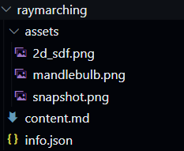

ut and paste

### Structure

I started by deciding how I wanted to structure and store the information for my site. I decided to use Markdown, a wildly popular language for creating formatted text. Markdowns power comes from its simplicity, matching my goal with the website as a whole.

As an example, here is this section in rendered form, markdown form, and the html generated from the markdown.

Oh, and heres some fancy things you can do as a showcase:

*italics*, `code`, **bold**

1. Numbered list!
2. Hi :)

```markdown
### Structure

I started by deciding how I wanted to structure and store the information for my site. For the content, I decided to use Markdown. Markdown is a wildly popular language for creating formatted text, using only the text itself.

As an example, here is this section in rendered form, markdown form, and the html generated from the markdown.

Oh, and heres some fancy things you can do as a showcase:

*italics*, `code`, **bold**

1. Numbered list!
2. Hi :)
```

```html
<h3>Structure</h3>
<p>I started by deciding how I wanted to structure and store the information for my site. For the content, I decided to use Markdown. Markdown is a wildly popular language for creating formatted text, using only the text itself.</p>
<p>As an example, here is this section in rendered form, markdown form, and the html generated from the markdown.</p>
<p>Oh, and heres some fancy things you can do as a showcase:</p>
<p><em>italics</em>, <code>code</code>, <strong>bold</strong></p>
<ol>
<li>Numbered list!</li>
<li>Hi :)</li>
</ol>
```

Markdown also allows for raw html to be inserted into the article, allowing me to use iframes for all of my demos. That way each project can host its own demos on its own site, decoupling the projects from the write-ups.

I also needed to store meta information about each article, like the title, date, description, ect. I once again chose the easiest and most popular option, json. Here is the info.json file for this writeup:

```json
{
    "title": "Building My Own Static Site Generator",
    "description": "Webpage generating frameworks are, to put it kindly, a huge pain. Instead of learning how to use someone else's package, I decided to spend a weekend writing my own! The system was designed for simplicity and maintainability, and is just over 100 lines of code. Oh, and it generated the website you're on right now!",
    "date": "3.30.2023",
    "tech": "Node.js, HTML, CSS, Javascript",
    "bits": "true"
}
```

Finally, I need a way to organize all of the assets for the page. I used a simple folder.

All of these elements are grouped into a folder, and placed under the /projects directory. Here's the full stack for my ray marching article:



### Templates

To keep the structure all nice and modular, I built templates for the home page, project page, and various list entries. The list entries are what you see on the left and under the projects section on the home page. Using templates allows for the content to be completely decoupled from the structure of the website, and be reusable if I ever decide to redesign or relocate. Where the content goes is designated by HTML comments, as shown below:

```html
<article id="article">
    <h1>
        <!-- TITLE -->
    </h1>
    <em class="date">
        <!-- DATE -->
    </em>
    <br>
    <!-- CONTENT -->
</article>
```

### From Markdown to HTML

Once all of the content has been filled in, it must be converted into HTML to be served as a webpage. I used a Node.js script for this purpose, because when in webdev, do as the web devs do.

A popular solution for generating HTML from Markdown is the npm package [markdown-it](https://github.com/markdown-it/markdown-it). Its easy to use and comes with a rich variety of plugins, so it was a natural fit. 

Using it is as simple as:

```js
var md = require('markdown-it');

md.render("# This will generate an H1 tag");
```

I often get in over my head with math, so I wanted to include support for Latex in the generator. Luckily, markdown-it has a pluggin for katex, a browser based Latex renderer. Installing it is simple:

```js
const tm = require('markdown-it-texmath');
var md = require('markdown-it')({ html: true }).use(tm, {
    engine: require('katex'),
    delimiters: 'dollars',
    katexOptions: { macros: { "\\RR": "\\mathbb{R}" } }
});
```

I also want to note (maybe its obvious, but it messed me up big time), that Katex needs its own stylesheet and Javascript to work properly. Don't be like me kids, install your dependencies on the front end too.

```html
<link rel="stylesheet" href="../styles/katex/katex.min.css">
<script defer src="../styles/katex/katex.min.js"></script>
```

And now I can use over complicated math expressions to my heart's desire! 

$$
f(\relax{x}) = \int_{-\infty}^\infty
    f\hat(\xi)\,e^{2 \pi i \xi x}
    \,d\xi
$$

### The Gory Details

The details of actually crawling the posts and generating the HTML is better explained through the actual code. See the full listing below if you're interested, but it boils down to crawling the project folder and calling .replace() many times to fill in the relevant fields. As the pages are crawled, a sidebar and homepage entry is also generated and added to a list. Once all pages are generated, I add the relevant sidebars and copy them to the /docs folder.

Here are the libraries I used for assistance:

I used [glob](https://www.npmjs.com/package/glob) to crawl the /projects folder and handle processing of each post.

For writing, copying, and deleting files I used [fs-extra](https://www.npmjs.com/package/fs-extra), a superset of the normal Node.js tools that allows you to do things like copying whole folders.

### Making it Pretty

Because code is a big part of my work, pretty syntax highlighting is a must. After shopping around a bit, I settled on [highlight.js](https://highlightjs.org/). It comes with hundred of themes and automatic language detection, and installing it was super easy:

```html
<!-- syntax highlighting-->
<link rel="stylesheet" href="../styles/highlight/styles/base16/bright.min.css">
<script src="../styles/highlight/highlight.min.js"></script>
<script>hljs.highlightAll();</script>
```

## Hosting

Github Pages is the king of convenience. On top of being integrated into my source control, its also free! I setup Pages serve from the /docs folder in my repo and it just works. It also offers configuration scripts for doing stuff like only deploying when a new release is created, but I opted to just serve directly from the main branch. I feel that mistakes and works in progress are an integral part of the design process, and including them makes my site feel more genuine and homely.

## The Result

This system was used to generate the website you're reading right now! Wow, an article about the website that generated it, so meta, so cool.

Here's the repository containing the code and all the files: [https://github.com/usedhondacivic/usedhondacivic.github.io](https://github.com/usedhondacivic/usedhondacivic.github.io)

And heres a full listing of the 100(ish) lines of code that contain all the magic: 

```js
const fs = require('fs');
const path = require('path');
const fsExtra = require('fs-extra');
const glob = require("glob");
const sharp = require("sharp");
const tm = require('markdown-it-texmath');
var md = require('markdown-it')({ html: true }).use(tm, {
    engine: require('katex'),
    delimiters: 'dollars',
    katexOptions: { macros: { "\\RR": "\\mathbb{R}" } }
});


// Grab the templates
const index_template = fs.readFileSync(path.resolve(__dirname, 'templates/index.html'), 'utf8');
const homepage_entry_template = fs.readFileSync(path.resolve(__dirname, 'templates/homepage_entry.html'), 'utf8');
const sidebar_entry_template = fs.readFileSync(path.resolve(__dirname, 'templates/sidebar_entry.html'), 'utf8');
const content_template = fs.readFileSync(path.resolve(__dirname, 'templates/content.html'), 'utf8');

// Clean the docs directory
fsExtra.emptyDirSync(path.resolve(__dirname, 'docs'));

// Copy over styles
fsExtra.copySync(path.resolve(__dirname, 'styles'), path.resolve(__dirname, 'docs/styles'))

var pages = new Object();
var info_arr = [];
var sidebar = [];
var sidebar_bits = [];
var homepage_entries = [];
var homepage_entries_bits = [];

// Copy a folder of images, and convert them to WebP to reduce loading time
function resize_and_relocate(src_dir, target_dir) {
    fs.mkdirSync(target_dir, { recursive: true });
    glob(src_dir + "/**", function (er, files) {
        files.forEach(path_name => {
            let file_split = path_name.split("/");
            let file_name = file_split[file_split.length - 1];
            if (file_name == "assets") return;
            sharp(path_name).toFile(target_dir + "/" + file_name.split(".")[0] + ".webp");
        })
    })
}

// Iterate over all of the posts
glob("projects/*/*.md", function (er, files) {
    files.forEach(path_name => {
        var info = JSON.parse(fs.readFileSync(path.resolve(__dirname, path_name.replace("content.md", "info.json"))));
        // Populate the content of a project page
        var contents_md = fs.readFileSync(path.resolve(__dirname, path_name), 'utf8');
        contents_md = contents_md.replaceAll(".png", ".webp").replaceAll(".jpg", ".webp").replaceAll(".jpeg", ".webp");
        var contents_html = md.render(contents_md);
        var contents_page = content_template.replaceAll("<!-- TITLE -->", info.title)
            .replace("<!-- CONTENT -->", contents_html)
            .replace("<!-- DATE -->", info.date)
            .replace("<!-- DESCRIPTION -->", info.description);
        var new_path = path_name.replace("projects", "docs").replace("/content.md", "");
        pages[new_path] = contents_page;
        // Copy assets
        resize_and_relocate(path_name.replace("/content.md", "/assets"), new_path + '/assets');
        info.rel_post_link = new_path.replace("docs", "");
        info.rel_snapshot_link = new_path.replace("docs", "") + "/assets/snapshot.webp";
        info_arr.push(info);
    })
    info_arr.sort(function (a, b) {
        return new Date(b.date) - new Date(a.date);
    })
    info_arr.forEach(info => {
        // Create sidebar entry
        var sidebar_entry = sidebar_entry_template.replaceAll("<!-- TITLE -->", info.title)
            .replace("<!-- DATE -->", info.date)
            .replaceAll("project_link", ".." + info.rel_post_link)
            .replace("snapshot_link", ".." + info.rel_snapshot_link);
        if (info.bits) {
            sidebar_bits.push(sidebar_entry);
        } else {
            sidebar.push(sidebar_entry);
        }
        // Create home page entry
        var homepage_entry = homepage_entry_template.replace("<!-- TITLE -->", info.title)
            .replace("<!-- DATE -->", info.date)
            .replace("<!-- DESCRIPTION -->", info.description)
            .replace("<!-- TECH -->", info.tech ? "Technologies used: " + info.tech : "")
            .replace("<!-- TOOLS -->", info.tools ? "Tools used: " + info.tools : "")
            .replaceAll("post_link", "." + info.rel_post_link)
            .replace("snapshot_link", "." + info.rel_snapshot_link);
        if (info.bits) {
            homepage_entries_bits.push(homepage_entry);
        } else {
            homepage_entries.push(homepage_entry);
        }
    })
    // Write the html files for each project to the docs folder
    for (const [path_loc, html] of Object.entries(pages)) {
        var content = html.replace("<!-- NAV -->", sidebar.join("\n"))
            .replace("<!-- NAV_BITS -->", sidebar_bits.join("\n"));
        fs.mkdirSync(path_loc, { recursive: true });
        fs.writeFileSync(path.resolve(__dirname, path_loc, "index.html"), content);
    }
    // Write the home page to the docs folder
    var content = index_template.replace("<!-- PROJECTS -->", homepage_entries.join("\n"))
        .replace("<!-- BITS -->", homepage_entries_bits.join("\n"));
    fs.writeFileSync(path.resolve(__dirname, "docs/index.html"), content);
    // Write global assets to the docs folder
    fsExtra.copySync(path.resolve(__dirname, "global_assets"), path.resolve(__dirname, "docs/global_assets"));
    // Write CNAME to the docs folder
    fs.writeFileSync(path.resolve(__dirname, "docs/CNAME"), "michael-crum.com");
})
```
