See the code here: [https://github.com/usedhondacivic/string-art-gen](https://github.com/usedhondacivic/string-art-gen)

<iframe src="https://michael-crum.com/string-art-gen/?showUI=false" title="String art demo"></iframe>

*Use the full tool at [https://michael-crum.com/string-art-gen/](https://michael-crum.com/string-art-gen/)*

## What is String Art?

String art, the process of creating images using a continous string wrapped around a frame of nails, was pioneered by engineer and artist [Petros Vrellis](https://www.instagram.com/pvrellis/?hl=en). The process seems like magic, creating order from a fundamentally chaotic tangle of string. The problem's unique mix of elegant engineering with physical beauty spoke to me, so I decided to create my own open source implementation. Heres the final product of a two string, black and white piece.

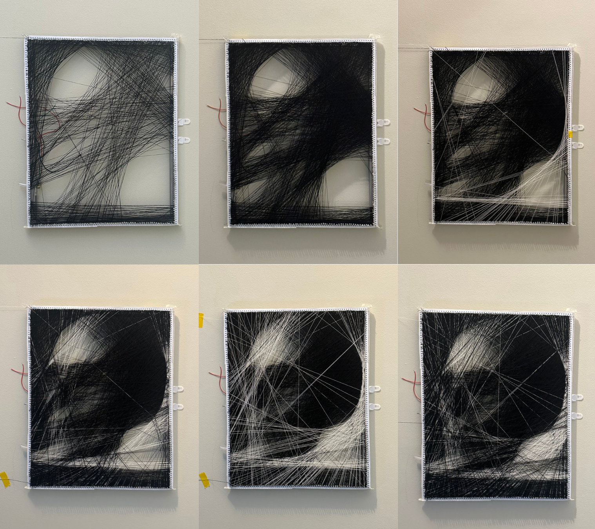

This piece took 12 hours of labor for 3200 connections in total.

There a many videos attempting to explain the string art algorithm in simple ways, but they all leave out crucial details required for an actually decent result. [Some people even have good reason](https://www.etsy.com/listing/1327763781/personalized-couple-string-art-portrait?gpla=1&gao=1&&utm_source=google&utm_medium=cpc&utm_campaign=shopping_us_-craft_supplies_and_tools&utm_custom1=_k_Cj0KCQjwtJKqBhCaARIsAN_yS_mGeFugi4R-d-7-MYH1H85DCjKGxe5mnfCua8gPwnzKw2axQa2KG4MaAqgBEALw_wcB_k_&utm_content=go_12665398257_121762925993_511610210343_pla-295462056867_c__1327763781_156087082&utm_custom2=12665398257&gad_source=1&gclid=Cj0KCQjwtJKqBhCaARIsAN_yS_mGeFugi4R-d-7-MYH1H85DCjKGxe5mnfCua8gPwnzKw2axQa2KG4MaAqgBEALw_wcB) to keep the algorithm obfuscated for monetary gain. However, I believe the math and logic behind the algorithm is just as beautiful as the end result. This article is meant to give some insight to those hoping to write their own implementation.

Of course I had to add my own spice to the algorithm. Publicly available implementations all make a variety of limiting assumptions that reduce the creative freedom of the user. Commonly the size and shape of the frame is completely fixed (and a just boring circle), the color of the thread is fixed, and the number of colors is limited to one or two. Using principled software development, I was able to avoid all of these constraints and give the user ultimate creative control over their piece. Now, how does it actually work?

## Gallery

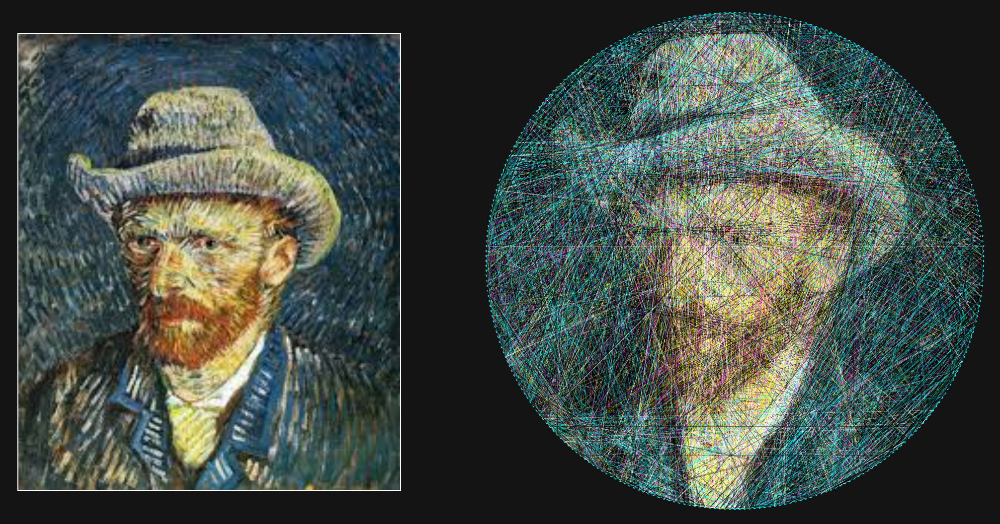
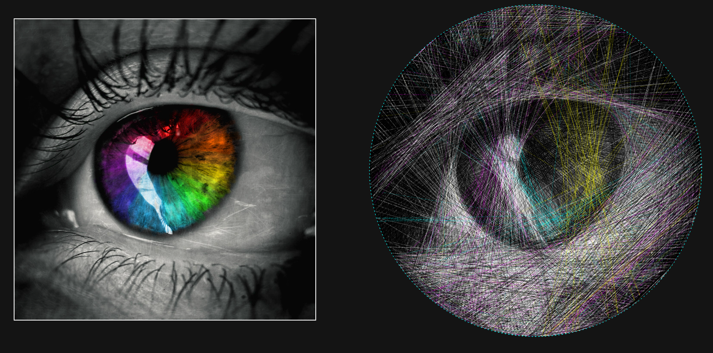
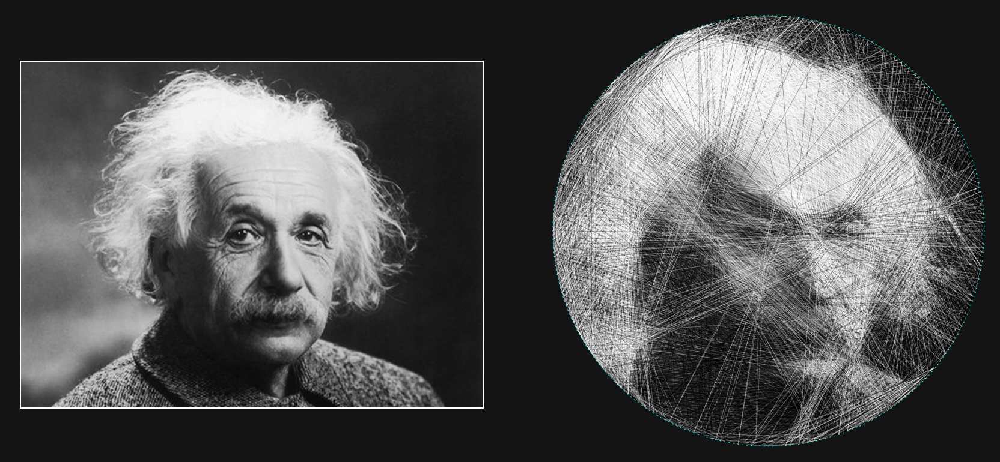
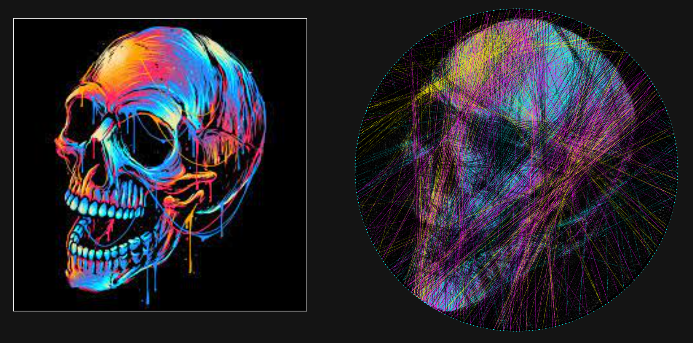
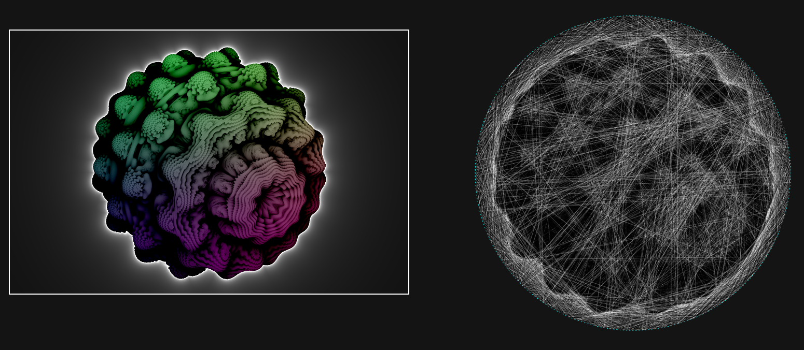


## From String to Image

When developing a new algorithm, I like to avoid information paralysis by first breaking it down to it's core components. Thinking of the algorithm as a blank box, what are the desired inputs and outputs? Obviously we have an image, and we should also supply information about the frame (number of nails, shape, size, ect). On the other side of the algorithm we need some reprentation of the string that will allow us to actually construct the image in the real world. My choice was to number each nail $1 ... \#nails$ and output the "instructions" as an ordered list of nails.


Knowing the output provides a good starting point for our algorithm - at each iteration, we need to pick which nail we want to connect to our current nail. This nail will be next in the list, and so on until we have the whole image.


What I've described so far is known as a "greedy algorithm". It's greedy in the sense that at each iteration, the algorithm makes the decision that is best for it only in that moment. It doesn't consider the effect down the road or on any previous steps, just the current state. This is good because it durastically decreases the compute time for each step, but is bad because the algorithm will have no sense of how the strings "work together" in the final product. In this instance the greedy approach gives a good approximation in excelent time, but in other cases you might look into [dynamic programming](https://en.wikipedia.org/wiki/Dynamic_programming) to get a better solution.

### We Have Gradient Descent at Home

Now we a tractable greedy step: given our current nail, find the best nail to move to next. Best, in this context, means the nail that, when connected to, will cause the greatest improvement in the approximated image. It can also be thought of as the connection that minimizes the difference between the approximated image and the real image (also known as the error). By following the connection that minimize error, updating the image to show the new connection, and repeating the approximated image will eventally converge to the real image.

If you've studied computer science, optimization, or machine learning, the steps I outlined may sound very familiar. The greedy approach to the string art algorithm reduces to [gradient descent](https://www.youtube.com/watch?v=IHZwWFHWa-w)! While knowledge of gradient descent isn't necessary to understand this article, it's a great algorithm for your toolkit and is useful for many optimization problems.


To use gradient descent we need to be able to calculate the error. As stated above, the error is the difference between the approximated image (the one being built from the string) and the original error. On computers, images are represented as pixels. Each pixel, in turn, is represented by three numbers representing red, blue, and green. For an image of size $n$ by $m$, this results in $n \cdot m \cdot 3$ values to represent the whole image. Therefore, the original image can be represented by a vector $\vec{o} \in \R^{3nm}$, and the approximated image as $\vec{a} \in \R^{3nm}$. We can then use any standard measure of distance between points to calculate the error. I chose to use the Euclidan norm, then square it to emphasize outlying error values (extremely bad or good connections).

$$\text{err}(\vec{a}) = ||\vec{o} - \vec{a}||_2^2 = \sum_{x = 1}^{3nm} (o_x - a_x)^2$$

In english, this subtracts the colors of each pixel in the approximated image from each pixel in the original image, then find the length of that vector.

To select the next connection, we need to calculate the gradient with respect to each nail that could be the next connection, then take the minimum. Because we have a discrete number of options for the next nail, we can use a [finite difference approximation](https://en.wikipedia.org/wiki/Finite_difference_method) to calculate the gradient. That is to say, we want to find the $c$ creates the most negative change in error between the image with and without the connection.

$$\underset{c}{\text{argmin}}\,(\text{err}(\vec{a} + c) - \text{err}(\vec{a}))$$

In this equation, $c$ represents a new nail to be connected to, and $\vec{a} + c$ represents the approximated image $\vec{a}$ with a line from the current nail to $c$ added to the image.


Great! We can now use gradient descent to minimize the error, leading to a high quality image approximation! Right?

### Taking Fear Out of the Machine

The implementation so far works poorly on real images. The first issue becomes obvious pretty quickly:

*image showing low detail*

None of the details get captured! This is a side effect of how we calculate error. Imagine running the algorithm on the following image, starting with a black background and using white string:

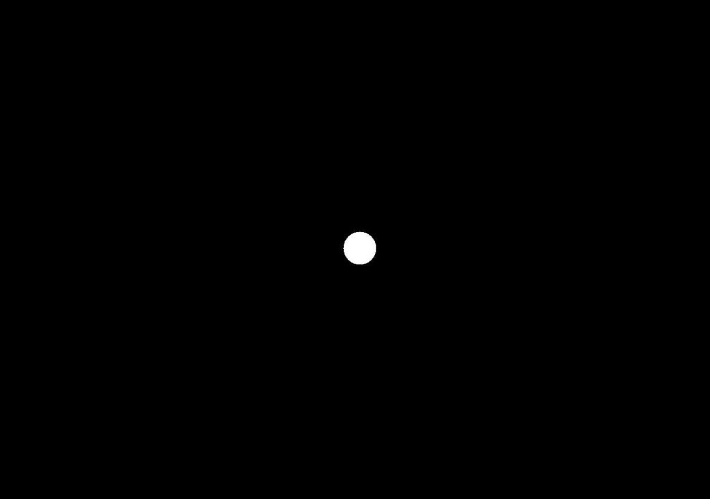

In order to show the white dot, the algorithm must choose to lay down a white string. By laying down a white string over the dot, the string would correctly color the dot white, but incorrectly color the black background along the rest of its length. Placing the string would greatly increase the error of the image, so the algorithm would never choose to do so.

To fix it, we must think a bit more about the problem we are trying to solve. The error function currently believes that errors are unfixable. It gives equal weight to how much the string messes up the image as it does to how much it improves the image. In reality, we know that incorrect colors can later be covered by a different string, correcting for the error in the past itteration. In order to capture detail in the image, we need to represent this fact in our minimization problem. We currently have

$$\underset{c}{\text{argmin}}\,(\text{err}(\vec{a} + c) - \text{err}(\vec{a})) =$$
$$\underset{c}{\text{argmin}}\,(\sum_{x = 1}^{3nm} (o_x - (\vec{a} + c)_x)^2 + (o_x - \vec{a}_x)^2)$$

The quantity $(o_x - (\vec{a} + c)_x)^2 + (o_x - \vec{a}_x)^2)$ represents the improvement of the approximation on a single pixel $x$ when connection $c$ is included. It is negative when the image improved, and positive when it got worse. We know that a single pixel getting worse can be fixed in a later iteration, so we shouldn't care about positive contributions at all. So we can write

$$\underset{c}{\text{argmin}}\,(\sum_{x = 1}^{3nm} \text{min}(0, o_x - (\vec{a} + c)_x)^2 + (o_x - \vec{a}_x)^2)$$

In a turn of phrase, this can be thought of as allowing the algorithm to run wihthout fear. It is no longer afraid of ruining existing progress with a new string, because it knows that any generated error can be fixed by future layered string.

Now the results are getting better:

*image of better results*

### Reverse Robot Optometry

However, there is still more room for improvement. Right now, the algorithm is looking at the string with perfect robotic eyesight. I understands each string as a seperate bar of color, no matter what is happening near it. Human eyes naturally blur nearby objects, averaging their colors together. Look to [pointillism](https://www.sothebys.com/en/articles/pointillism-7-things-you-need-to-know) for examples of artworks made exploiting this effect.

Because the algorithm cannot blur the colors together, it has no concept of shading or color mixing. This leads to blocky images and poor performance when multicolor strings are used.

To fix this, we need to effectively blur the algorithms perception. A common approach is to using [convolution](https://developer.apple.com/documentation/accelerate/blurring_an_image), but this approach is extremely comutationally expensive. Instead, we can simply lower the resolution of the images we feed to the algorithm.

In my setup, I preprocess the image and resize it such that one pixel corresponds to the diameter of the thread I plan to use. This simplifies the string drawing routine for the simulated string so I can just fill any pixel it passes through with the strings color. To blur the algorithms perception, I again downscale the image by some factor $d$. Now a strings diameter is $1/d$ pixels, so fully coloring the pixels it passes through doesn't make sense. Instead, I add the color to the pixels with a transparency of $1/d$.

*image showing before and after*

This both simulates the bluring effect of human eyes and reduces computation time due to a lower effective image resolution.

After this improvement, we're really getting somewhere.

*Show new image*

### Performance

While its easy to come up with a algorithm that will solve a problem eventually, it's much harder to find one that solve it efficently. As an example, we could generate every single 10,000 length nail order and find the one that generates the best image. This would generate a perfect image every time, but for an image with 300 nails it would require checking $300^{10,000}$ combinations. This would take many, many, lifetimes to compute, so we have to be a bit more clever.

The algorithm presented here is much better, but still isn't quick enough for the responsive web app I was envisioning. The big bottle neck is evaluting the error function

$$\underset{c}{\text{argmin}}\,(\sum_{x = 1}^{3nm} \text{min}(0, o_x - (\vec{a} + c)_x)^2 + (o_x - \vec{a}_x)^2)$$

This itterates over all $3nm$ pixels for each of $c$ nails, and is run on every single iteration. With an HD image (1080x720), 300 nails, and 10,000 iterations, this is 7 **trillion** evaluations. Even with a fast computer, this will take several hours for a single image.

The optimization comes from realizing what we actually need to evaulate. Why are we looping over every pixel in the image, when each line only changes the pixels it runs over? If we could only consider those points, we could lower the image comparison from $3nm$ operations to $3\sqrt{(n^2 + m^2)}$. With the 1080x720 image from before, this is a speed up by a factor of $2332800 / 3894 = 600$! This brings our several hour computation time down to just minutes.

Through some imaginative abuses of notation, we can write:

$$\underset{c}{\text{argmin}}\,(\sum_{x \in c} \text{min}(0, o_x - (\vec{a} + c)_x)^2 + (o_x - \vec{a}_x)^2)$$

In code, this change will simply be changing the loop to run over only pixels that intersect the new string rather than all pixels in the image. To calculate the relevant pixels I used [Bresenhams line algorithm](https://www.middle-engine.com/blog/posts/2020/07/28/bresenhams-line-algorithm), which is a common fixture of computer graphics.

### Lets get colorful

So far, I haven't adressed the notion of color whatsoever. By taking a mathematical approach to the problem, we've stumbled across an algorithm that can be generalized to any number of colors and number of strings.

The key implementation question lies in computing

$$(\vec{a} + c)_x$$

within the error function. As a reminder, this value is pixel $x$ of the approximated image $\vec{a}$ with line $c$ added to it.

Lets let the color of line $c$ (really the color of the associated thread) be represented by $k(c).$ Using the same notation $k(a_x)$ is the color of the approximated image at pixel $x$ before the line is added.

As discussed above, I'm also applying a transparency of $1/d$ due to image downscaling. Using [color interpolation](https://michael-m.medium.com/true-color-interpolation-a1a17352ebf0), the new pixel color is:

$$k(c)(1/d) + k(\vec{a})(1 - 1/d)$$

In practice, this is be implemented independently on each channel (red, blue, and green).

There is a lot to be said about the validity of this approximation. The human eye is [much more sensitive to greens and yellows](https://www.olympus-lifescience.com/en/microscope-resource/primer/lightandcolor/humanvisionintro/#:~:text=The%20human%20eye%20is%20much,in%20the%20interest%20of%20tradition.) than it is to blues and reds, so for a more accurate color mixture those colors should be emphasized. My color theory is no good though, so I chose to ignore the problem with a "good enough" solution.

Now that $(\vec{a} + c)_x$ can be evalutated for any thread color, we can use multiple threads with little modification to the algorithm. Simply run the algorithm for each string independently, and at each step use the string that has the best next move (as defined by the error function).


### Tying it all together

So far I've refrained from presenting any code in an effort to keep the algorithm language agnostic. Reading through code line by line is a huge pain, and is a poor way to communicate concepts. If you've gotten this far, though, you are probably interested in writing your own implementation. You should now be prepared to read though my code, [which is available here](https://github.com/usedhondacivic/string-art-gen).

I've tried to add comments that map to the sections of this article, so reference back here if any part is confusing. If you need any further help, feel free to reach out to me at the contacts listed on my home page!

## The UI Honey Pot

Few, that was a lot of work to design that algorithm. It would be a shame if no one ever used it. So how do you make people actually want to engage with your tool?

### How to make a tool people will actually use

The simple truth is that no one will ever download and run your python program or C++ excecutable, no matter how cool it is. An easily accessable web tool that produces a worse product will always win out, simply because the average user is both non-technical and in a rush to get a result.

So if you want people to actually see your hard work, your tool needs to be **hosted**, **interactive**, and **attractive**. These are the non-tangeables that are often non-intutative to technical people, yet are sometimes more important that the work itself. I've written an article on [creating this website](../static_page_gen/) that could serve as a great starting point for hosting your own website. [GitHub Pages](https://pages.github.com/) is a godsend, and (in my opinion) is the clear choice for free web-hosting today.

My implementation is in javascript, as I was targeting a web deployment from the begining. If you really love your Rust, Python, or other language of choice, and have your heart set on using it, consider writing an API to serve the results to a simple web front end. [Amazon Web Services](https://aws.amazon.com/) is a popular choice in that domain.

### A Love Letter to D3.js (and SVG)

For interactive visuals and data visualizations, I've fallen in love with [D3.js](https://d3js.org/). D3 leverages the power of Scalable Vector Graphics (SVG) to create fluid visualizations that look incredible. SVG's were designed from the begining to work on the web, meaning that they are universally supported and blazingly fast. No more worries about bispoke visualization packages that might break with the next update of chrome.

For this project, I took advantage of the built in [zoom and pan](https://www.d3indepth.com/zoom-and-pan/) behavior to allow users to inspect the work from multiple scales. The ability to move around the visualization creates a playful experience, making the user more likely to experiment and spend more time on the site.

### Keeping it Simple

I commonly see developers overrely on and the latest Javascript libraries instead of just stopping to think for a second. As a humorous yet slightly depressing example, take [the NPM package `is-odd`](
https://www.npmjs.com/package/is-odd). With almost 300k weekly downloads, the package does exactly what its named for: tell you if a number is odd.

Instead, developers should reach for the rich variety of tools already packed into Javascript. The [UI in my tool](https://michael-crum.com/string-art-gen/), is programatically generated using pure Javascript. Take the buttons for example:

```js
class UIElement {
    constructor(desc, name, parent, callback, label) {
        this.desc = desc;
        this.name = name;
        this.parent = parent;
        this.callback = callback;
        if (label) {
            this.label = document.createElement("label");
            this.label.for = name;
            this.label.innerHTML = desc;
            parent.appendChild(this.label);
        }
    }
}

class Button extends UIElement {
    constructor(desc, name, parent, callback) {
        super(desc, name, parent, callback, false);
        this.element = document.createElement("button");
        this.element.id = name;
        this.element.innerHTML = `<b> ${this.desc}</b>`;
        this.element.addEventListener("click", callback);
        parent.appendChild(this.element);
    }
}

let basic_options = document.getElementById("basic");

let GUI = {
    init() {
        // Download = 
        this.nail_seq_download = new Button(
            "Nail sequence",
            "nail_sequence",
            download,
            () => {
                graph.download_nail_seq();
            });
        this.frame_download = new Button(
            "Frame with numbering",
            "frame_download",
            download,
            () => {
                graph.download_frame();
            });
        // Basic
        this.regenerate = new Button(
            "Regenerate",
            "regenerate",
            controls,
            () => {
                render_image()
            });
    }
}
```

No React, no bootstrap, no huge dependency list, and it does exactly what it needs to do and nothing more. Software bloat is the quickest way to make you hate your own project and never finish it, so fight the urge to pickup the shiniest library whenever the going gets tough.

## Further research: Computed Tomography and Fast Fourier Transforms

This project took me down an interesting rabit hole worth some further exploration. I want to briefly cover it here, in hopes someone will take a crack at them down the line.

To my suprise, I realized the string art problem is the exact inverse of what CT scans are doing. With string art, the goal is to take an image and decompose it into chords of varying densities (brightnesses). In CT scans, an emiter and sensor are used to detect the density of a subject along a line. By collecting datapoints in a full circle around the subject, it is possible to reconstruct a crossectional image from just the density readings.

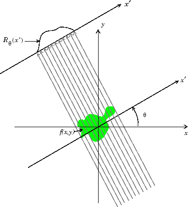
> *The Radon Transform*

The [Radon Transform](https://en.wikipedia.org/wiki/Radon_transform) is the function formed from taking several perpendicular density readings. 


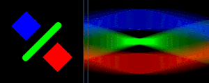

> *The Radon transform performed along hornizontal scanlines, and the resulting signal. Animation couresty of Wikipedia*

The reconstruction technique is know as the [Radon Transform](https://en.wikipedia.org/wiki/Radon_transform), and takes advantage of the [Fourier Slice Theorem](https://en.wikipedia.org/wiki/Projection-slice_theorem). The Fourier Slice Theorem shows that the Fourier Transform of the Radon transform of a reading forms a radial "slice" of the 2D FFT of the original image. After using the slices to recreate the 2D FFT, an inverse FFT results in reconstructed image.

But how is this useful for string art? The quick answer is computation speed. Instead of computing the error function discretely for each string, we could sample the 2D FFT of the image, then use the inverse of the Fourier Slice Theorem to reconstruct the FFT of the candidate connections. The inverse FFT would then allow us to sample the errors of each connection.

I'm unsure if this would actually speed up the processing speed, and I don't have time to try and implement a solution based on this concept. If you chose to try, I would recommend [checking out this paper](https://pubmed.ncbi.nlm.nih.gov/25080112/#:~:text=The%20GFST%20method%20can%20be,to%20Cartesian%20coordinates%20in%20the) which presents a fan beam generalization of the reconstruction process, which is more relevant to the string problem.

## Conclusion

Generative, algorithmic art is a wonderful area to explore. Selfishly I hope my journey can inspire and aid in the creation of other works, so that I can enjoy viewing them.

## Resources

* [The Mathematics of String Art - Virtually Passed on Youtube](https://www.youtube.com/watch?v=WGccIFf6MF8)

* [String Art: Towards Computational Fabrication of String Images - Birsak Et Al](https://www.peterwonka.net/Publications/pdfs/2018.EG.Birsak.StringArt.pdf)

* [Fan beam image reconstruction with generalized Fourier slice theorem](https://pubmed.ncbi.nlm.nih.gov/25080112/#:~:text=The%20GFST%20method%20can%20be,to%20Cartesian%20coordinates%20in%20the)